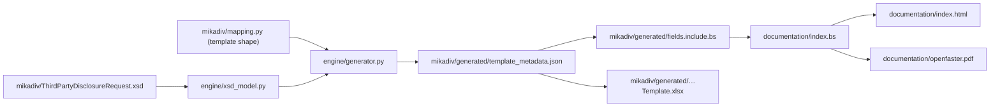

# OpenFASTER

**Vendor-independent, interoperable family of open standards for EU
withholding-tax and dividend-reporting data exchange under MiKaDiv and FASTER.**

OpenFASTER is designed as a suite of modular specifications (in the spirit of
families such as CSS or RDF), with the long-term ambition of maturing onto a
formal international standards track. Its first concrete module is the **MiKaDiv
Third-Party Disclosure format**, derived directly from
[`mikadiv/ThirdPartyDisclosureRequest.xsd`](mikadiv/ThirdPartyDisclosureRequest.xsd)
(German §45b EStG capital-income disclosure).

## Repository layout

The repository is organized by concern - a shared engine, one folder per module,
and the documentation/specification kept separate:

```
├── engine/                        # shared, module-agnostic generator
│   ├── xsd_model.py               #   Layer 1: XSD extractor (via xmlschema)
│   └── generator.py               #   Layer 3: renders workbook + docs + include
├── mikadiv/                       # the MiKaDiv Third-Party Disclosure module
│   ├── ThirdPartyDisclosureRequest.xsd   # schema (machine source of truth)
│   ├── mapping.py                 #   Layer 2: template shape for this module
│   └── generated/                 #   generated artifacts (do not edit by hand)
│       ├── MiKaDiv_ThirdPartyDisclosure_Template.xlsx
│       ├── template_metadata.json
│       ├── TEMPLATE_FIELDS.md
│       └── fields.include.bs
├── documentation/                 # the specification / site
│   ├── index.bs                   #   Bikeshed source (includes the module include)
│   ├── requirements-spec.txt      #   spec build deps (bikeshed, weasyprint)
│   ├── index.html                 #   built (generated)
│   └── openfaster.pdf             #   built (generated)
├── generate_template.py           # build entry point (wires engine + modules)
├── requirements.txt               # engine deps (openpyxl, xmlschema)
├── Dockerfile                     # reproducible spec + PDF build
└── vercel.json
```

Adding a future module (e.g. FASTER) means adding a sibling module folder with
its own XSD + `mapping.py`, and one `ModuleConfig` entry in
[`generate_template.py`](generate_template.py) - the engine and documentation
stay shared.

## Single source of truth

The **XSD is the machine source of truth**. All field-level content -
descriptions, type/format strings, requiredness, cardinality and enumerations
(values *and* their meanings) - is parsed directly out of each module's XSD;
none of it is hand-typed. Every human-facing artifact is **generated** from that
schema, so nothing can drift apart:



Generation is layered so the schema stays authoritative while the template's
presentation stays controllable:

1. **`engine/xsd_model.py`** (Layer 1) - loads the XSD with
   [`xmlschema`](https://pypi.org/project/xmlschema/) and answers "what does the
   schema say about field X of type Y?" (documentation, format, requiredness,
   enums). No hand-typed content. Shared by every module.
2. **`mikadiv/mapping.py`** (Layer 2) - declares the template *shape*: which
   sheets exist, their column order, how nested XSD choices flatten into columns,
   and the few presentation-only helper columns (e.g. `RecordType`,
   `PersonTaxCategory`) that model a schema choice as a flat column. It says
   *where* each column comes from, never *what it means*.
3. **`engine/generator.py`** (Layer 3) - renders the workbook, metadata, docs
   and Bikeshed include from the merged model. Shared by every module;
   parametrised per module by a `ModuleConfig` in `generate_template.py`.

| File | Role | Edited by hand? |
| --- | --- | --- |
| [`mikadiv/ThirdPartyDisclosureRequest.xsd`](mikadiv/ThirdPartyDisclosureRequest.xsd) | Schema; machine source for all field content | Yes (the schema) |
| [`documentation/index.bs`](documentation/index.bs) | Bikeshed specification source (prose, structure, roadmap) | Yes |
| [`engine/xsd_model.py`](engine/xsd_model.py) | Layer 1: XSD extractor (via `xmlschema`) | Yes |
| [`mikadiv/mapping.py`](mikadiv/mapping.py) | Layer 2: template shape + presentation-only columns | Yes |
| [`engine/generator.py`](engine/generator.py) | Layer 3: renders metadata, docs, Bikeshed include, and Excel template | Yes |
| [`generate_template.py`](generate_template.py) | Build entry point; wires the engine to each module | Yes |
| `mikadiv/generated/template_metadata.json` | Machine-readable field metadata store | Generated |
| `mikadiv/generated/fields.include.bs` | Data dictionary + enumerations, pulled into `index.bs` | Generated |
| `mikadiv/generated/TEMPLATE_FIELDS.md` | Human-readable field reference | Generated |
| `mikadiv/generated/MiKaDiv_ThirdPartyDisclosure_Template.xlsx` | Fillable Excel template | Generated |
| `documentation/index.html` / `documentation/openfaster.pdf` | Built specification (deployed to openfaster.org) | Generated |

## Building the specification

The data dictionary in the spec is regenerated from the metadata, then compiled
by [Bikeshed](https://speced.github.io/bikeshed/) to HTML, and rendered to PDF.

### Option A - local Python

```bash
python -m pip install -r requirements.txt -r documentation/requirements-spec.txt
bikeshed update            # first run only, fetches Bikeshed data files
python generate_template.py                       # refresh the generated include
bikeshed --allow-nonlocal-files --die-on=link-error spec documentation/index.bs documentation/index.html
weasyprint --stylesheet documentation/print.css documentation/index.html documentation/openfaster.pdf   # PDF (see note)
```

> Note: WeasyPrint needs native libraries (Pango/Cairo/HarfBuzz). These are
> present on Linux/CI but awkward on Windows - use Option B there for the PDF.

### Option B - Docker (reproducible, recommended on Windows)

```bash
docker build -t openfaster-spec .
docker run --rm -v "${PWD}:/spec" openfaster-spec
```

This regenerates the data dictionary, builds `documentation/index.html`, and
renders `documentation/openfaster.pdf` back into the mounted directory.

### Option C - CI

[`.github/workflows/spec.yml`](.github/workflows/spec.yml) runs the full build on
every push, uploads `documentation/index.html` + `documentation/openfaster.pdf`
as an artifact, and (on `main`) publishes them to GitHub Pages - so
openfaster.org always reflects `documentation/index.bs`.

## Deploying to openfaster.org

Author here, then publish the built artifacts. You do **not** need to edit the
live site directly: copy `documentation/index.html` (and
`documentation/openfaster.pdf`) to the openfaster.org host, or let the CI
workflow deploy them to GitHub Pages.

## Editing conventions

The specification follows W3C conventions so it can move toward a formal track
later:

- [W3C Manual of Style](https://w3c.github.io/manual-of-style/) for prose and
  conformance language (RFC 2119 keywords).
- [W3C Editor's Guide](https://w3c.github.io/guide/editor/) for structure.
- [W3C TR style sheets](https://www.w3.org/StyleSheets/TR/) applied by Bikeshed.

To change **field content** (a description, a type, an enum value or its
meaning), edit `mikadiv/ThirdPartyDisclosureRequest.xsd` and re-run
`generate_template.py`. To change the **template shape** (add/re-order a column,
adjust a presentation-only helper column), edit `mikadiv/mapping.py`. Never edit
anything under `mikadiv/generated/` by hand.

---

# The Excel template

`generate_template.py` also builds a self-documenting Excel workbook that mirrors
the disclosure structure. It lets non-technical users capture disclosure data in
a spreadsheet, with each field annotated by its English description and expected
type, and enum fields presented as dropdowns.

## Quick start

```bash
python -m pip install -r requirements.txt
python generate_template.py
```

This writes, into `mikadiv/generated/`:

- `MiKaDiv_ThirdPartyDisclosure_Template.xlsx` - the fillable template.
- `template_metadata.json` - the field metadata store (source for docs + spec).
- `TEMPLATE_FIELDS.md` - a human-readable field reference.
- `fields.include.bs` - the Bikeshed include consumed by `documentation/index.bs`.

Re-run any time to regenerate everything (for example after the XSD changes).

> Note: if the `.xlsx` is open in Excel, close it first - Windows locks open
> files and the script cannot overwrite it. (The other outputs still refresh.)

Requirements: Python 3.9+, `openpyxl` and `xmlschema` (pinned in
[`requirements.txt`](requirements.txt)).

## How each sheet is laid out

Every data sheet uses four frozen header rows; data entry starts at row 5:

| Row | Meaning |
| --- | --- |
| 1 | Technical column name (as in the XSD) |
| 2 | Plain-English description of what to enter |
| 3 | Expected type / format / constraints (enum fields list the allowed values) |
| 4 | `Required` / `Optional` / `Conditional` |

The first column (`RequestId`) and the header rows are frozen so they stay
visible while scrolling. Enum-backed cells show a native in-cell dropdown and
reject values outside the allowed list.

## Sheets

| Sheet | Rows per RequestId | Purpose |
| --- | --- | --- |
| `0 Legend Notes` | - | How to read the template, requiredness legend, cardinality, linking rules |
| `1 Requests Master` | 1 | Request-level metadata; `RecordType` = Request or Cancel; account owner scalars |
| `2 Security Related Information` | 0..1 | Security identification + income / tax information, incl. the conditional depositary-receipt (e.g. ADR) block (required for Request; DR fields required when `IsDepositaryReceipt` = true) |
| `3 Tax Voucher Individuals` | up to 2 total (tax voucher) | Natural persons receiving tax vouchers |
| `4 Tax Voucher Legal Persons` | up to 2 total (tax voucher) | Corporate / institutional tax-voucher recipients |
| `5 Third Party Individuals` | up to 5 total (third party) | Natural persons serving as third-party owners |
| `6 Third Party Legal Persons` | up to 5 total (third party) | Corporate / institutional third-party entities |
| `7 Custody Chain` | up to 20 | Intermediary links, sorted by `NumberInChain` |
| `8 FIFO Trades` | up to 1000 each way | FIFO receipts & deliveries (`ReceiptsAndDeliveriesMode` = FiFo) |
| `9 Raw Transactions All` | unbounded | Non-FIFO raw ledger (`ReceiptsAndDeliveriesMode` = All) |

A hidden `_Lists` sheet backs any long dropdown lists.

## Linking model

`RequestId` is the key on `1 Requests Master` and appears as the first column on
every other sheet. It is used **only** to link the sheets together, so any
unique value works (it does not need to be a UUID). Use the same `RequestId`
value to join a request's data across all sheets and reconstruct one full
disclosure record.

- **Cancellations:** set `RecordType = Cancel` on `1 Requests Master`, fill
  `PreviousRequestIdForCancellation` (and optionally `ReportSerialNumber`), and
  leave all other sheets empty for that `RequestId`.
- **Community recipients:** a community tax-voucher receiver (up to 10 members)
  is captured by setting `ReceiverGroupType = CommunityMember` on the tax
  voucher sheets and giving all members of one community the same
  `CommunityGroupId`.

## Customising

The template is generated in three layers (see
[Single source of truth](#single-source-of-truth)):

- **Field content comes from the XSD.** A description, type/format, requiredness,
  or enum value/meaning is read from `mikadiv/ThirdPartyDisclosureRequest.xsd` by
  [`engine/xsd_model.py`](engine/xsd_model.py). To change it, change the schema.
- **Template shape lives in [`mikadiv/mapping.py`](mikadiv/mapping.py):**
  - `SHEET_ORDER` and the per-sheet field lists - each column referencing an XSD
    element/attribute (`E`/`A`/`P`) or a presentation-only synthetic column
    (`SYN`), yielding `(name, description, type_display, requiredness, enum_key)`.
  - `ENUM_ORDER` / `XSD_NAMED_ENUMS` / `XSD_INLINE_ENUMS` / `SYNTHETIC_ENUMS` -
    where each dropdown's values and meanings come from.
  - `SHEET_INFO` and `LEGEND_ROWS` - the editorial sheet/legend prose.
- **Rendering lives in [`engine/generator.py`](engine/generator.py):**
  `_build_sheet()` (header rows, styling, freeze panes, dropdowns) and
  `_build_metadata()` / `_write_documentation_md()` / `_write_bikeshed_include()`
  (the JSON, Markdown and Bikeshed exports), parametrised per module by a
  `ModuleConfig` in [`generate_template.py`](generate_template.py).

Re-run the script to refresh every output at once - the Excel template, the
documentation, and the specification's data dictionary.

## License

[CC BY 4.0](https://creativecommons.org/licenses/by/4.0/deed.en)
