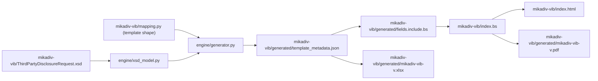
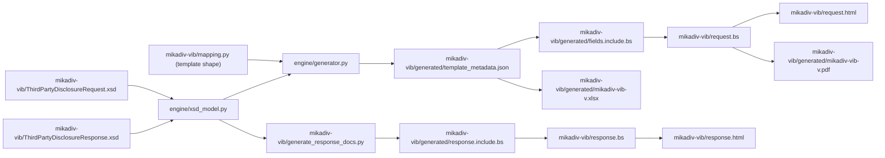

# MiKaDiv lifecycle: Request/Response split Implementation Plan

> **For agentic workers:** REQUIRED SUB-SKILL: Use superpowers:subagent-driven-development (recommended) or superpowers:executing-plans to implement this plan task-by-task. Steps use checkbox (`- [ ]`) syntax for tracking.

**Goal:** Split `mikadiv-vib` into a landing page plus a corrected Request document and a new,
auto-generated Response document; narrow the Excel template to New-Report-only.

**Architecture:** Eight sequential tasks. Tasks 1-2 build the Response side (vendor the XSD,
build a documentation-only generator reusing the existing XSD-parsing layer, write the document).
Task 3 narrows the Excel template. Task 4 moves and fixes the Request content. Task 5 builds the
new landing page, depending on 2 and 4's final titles/URLs. Tasks 6-7 (CI, README) describe the
final state, sequenced last among content tasks. Task 8 is the merge-gated live verification.

**Tech Stack:** Python 3.12 (`xmlschema`, `openpyxl`), Bikeshed, WeasyPrint, GitHub Actions,
Vercel.

**Spec:** `docs/superpowers/specs/2026-08-25-mikadiv-lifecycle-request-response-design.md`

## Global Constraints

- **Request-type taxonomy is exactly three**: New Report, Correction (full resubmission +
  `PreviousRequestIdForCorrection`), Cancellation (`CancelMiKaDivReportingForIncomeType`,
  `PreviousRequestIdForCancellation` required). No supplement/amendment concept exists in
  VIB's schema.
- **Only New Report stays Excel-driven.** Correction/Cancellation are platform-UI-driven (out
  of this plan's scope) — the Excel template's `RecordType` field is dropped entirely.
- **Site structure**: `/mikadiv-vib` becomes a landing page; `/mikadiv-vib/request` (bank-facing,
  `Shortname: mikadiv-vib-request`) and `/mikadiv-vib/response` (implementer-facing,
  `Shortname: mikadiv-vib-response`) are its two documents. All three files are flat siblings in
  `mikadiv-vib/` (no subdirectory per document), matching `streamld/`'s convention.
  `mikadiv-vib/header.include` is shared by all three automatically (same directory) — no new
  per-directory header copy needed.
- **Response document content is auto-generated** from `ThirdPartyDisclosureResponse.xsd` via
  `engine.xsd_model.XsdModel` (the same field-resolution layer the Request side uses) — never
  hand-typed, to avoid reintroducing the drift this plan's own predecessor found. No Excel
  template, no PDF for the Response side.
- **`DOCVERSION` moves to `mikadiv-vib/request.bs`** (it no longer belongs on the landing page)
  — every place that reads it (the CI workflow, `README.md`) updates accordingly.
- **`--die-on=link-error` stays on** for every Bikeshed invocation.
- **Never hand-edit anything under `mikadiv-vib/generated/`.**
- Five accuracy fixes land in the Request document (see Task 4) — all independently verified
  against VIB's real XSD and sample data during this plan's design.

---

### Task 1: Vendor the Response XSD + build its documentation-only generator

**Files:**
- Create: `mikadiv-vib/ThirdPartyDisclosureResponse.xsd`
- Create: `mikadiv-vib/generate_response_docs.py`
- Generate: `mikadiv-vib/generated/response.include.bs`

**Interfaces:**
- Consumes: `engine.xsd_model.XsdModel`, `engine.xsd_model.Field` (existing, unchanged).
- Produces: `mikadiv-vib/generated/response.include.bs` (a Bikeshed include), consumed by Task 2.

- [ ] **Step 1: Vendor the real Response XSD**

Write `mikadiv-vib/ThirdPartyDisclosureResponse.xsd` with exactly this content (VIB's real
published schema, confirmed valid XML and already deep-read during this plan's design):

```xml
<?xml version="1.0" encoding="utf-8"?>
<xs:schema targetNamespace="http://taxinfotransfer.org/tpd/1.0/ThirdPartyDisclosureResponse.xsd"
           xmlns="http://taxinfotransfer.org/tpd/1.0/ThirdPartyDisclosureResponse.xsd"
           xmlns:tpd="http://taxinfotransfer.org/tpd/1.0/ThirdPartyDisclosureResponse.xsd"
           xmlns:xs="http://www.w3.org/2001/XMLSchema"
           version="1.0"
           elementFormDefault="qualified">

	<xs:element name="ThirdPartyDisclosureResponse">
		<xs:annotation>
			<xs:documentation xml:lang="en">Root element for resonse of custodian to disclosure of custodian accounts</xs:documentation>
			<xs:documentation xml:lang="de">Wurzelelement für Rückmeldung der Verwahrstelle zur Offenlegung von Steuerinformationen für B-Depots</xs:documentation>
		</xs:annotation>
		<xs:complexType>
			<xs:sequence>
				<xs:element name="ResponseToDisclosureForIncomeType" type="ResponseToDisclosureForIncomeType" maxOccurs="unbounded" ></xs:element>
			</xs:sequence>	
		</xs:complexType>		
	</xs:element>

	<xs:complexType name="ResponseToDisclosureForIncomeType">
		<xs:annotation>
			<xs:documentation xml:lang="en">Base type for the disclosure of an income. Not for direct use.</xs:documentation>
			<xs:documentation xml:lang="de">Basistyp für die Offenlegung eines Einkommens. Nicht für die direkte Verwendung gedacht.</xs:documentation>
		</xs:annotation>
		<xs:sequence>
			<xs:element name="ProcessingStatus">
				<xs:annotation>
					<xs:documentation xml:lang="en">Processing status.</xs:documentation>
					<xs:documentation xml:lang="de">Status der Verarbeitung.</xs:documentation>
				</xs:annotation>
				<xs:simpleType>
					<xs:restriction base="xs:string">
						<xs:enumeration value="Receive" />
						<xs:enumeration value="StructureValidation" />
						<xs:enumeration value="ContentValidation" />
						<xs:enumeration value="Plausibilization" />
						<xs:enumeration value="Reporting" />
						<xs:enumeration value="TaxCertification" />
					</xs:restriction>
				</xs:simpleType>
			</xs:element>
			<xs:element name="ProcessingResult">
				<xs:annotation>
					<xs:documentation xml:lang="en">Processing result.</xs:documentation>
					<xs:documentation xml:lang="de">Ergebnis der Verarbeitung.</xs:documentation>
				</xs:annotation>
				<xs:simpleType>
					<xs:restriction base="xs:string">
						<xs:enumeration value="Success" />
						<xs:enumeration value="Error" />
					</xs:restriction>
				</xs:simpleType>
			</xs:element>
			<xs:element name="ProcessingCompleted" type="xs:boolean" />
			<xs:element name="Messages">
				<xs:complexType>
					<xs:sequence>
						<xs:element name="Message"  minOccurs="0" maxOccurs="unbounded">
							<xs:complexType>
								<xs:sequence>
									<xs:element name="Code" type="xs:string" minOccurs="0" />
									<xs:element name="Text" type="xs:string" />
									<xs:element name="Level">
										<xs:simpleType>
											<xs:restriction base="xs:string">
												<xs:enumeration value="Information" />
												<xs:enumeration value="Warning" />
												<xs:enumeration value="Error" />
											</xs:restriction>
										</xs:simpleType>
									</xs:element>
									<xs:element name="Reference" type="xs:string" minOccurs="0" />
								</xs:sequence>
							</xs:complexType>
						</xs:element>
					</xs:sequence>
				</xs:complexType>
			</xs:element>
			<xs:element name="Records">
				<xs:complexType>
					<xs:sequence>
						<xs:element name="Record" minOccurs="0" maxOccurs="unbounded">
							<xs:complexType>
								<xs:sequence>
									<xs:element name="Content" type="xs:string" />
									<xs:element name="RecordType">
										<xs:simpleType>
											<xs:restriction base="xs:string">
												<xs:enumeration value="TaxDocumentIdentifier" />
												<xs:enumeration value="Other" />
											</xs:restriction>
										</xs:simpleType>
									</xs:element>
									<xs:element name="RecordTypeInfo" type="xs:string" />
								</xs:sequence>
							</xs:complexType>
						</xs:element>
					</xs:sequence>
				</xs:complexType>
			</xs:element>
			<xs:element name="Documents">
				<xs:complexType>
					<xs:sequence>
						<xs:element name="Document"  minOccurs="0" maxOccurs="unbounded">
							<xs:complexType>
								<xs:sequence>
									<xs:element name="FilePath" type="xs:string" />
									<xs:element name="ContentMimeType" type="xs:string" />
									<xs:element name="DocumentType">
										<xs:simpleType>
											<xs:restriction base="xs:string">
												<xs:enumeration value="TaxCertificate" />
												<xs:enumeration value="Information" />
												<xs:enumeration value="Other" />
											</xs:restriction>
										</xs:simpleType>
									</xs:element>
									<xs:element name="Reference" type="xs:string" minOccurs="0" />
								</xs:sequence>
							</xs:complexType>
						</xs:element>
					</xs:sequence>
				</xs:complexType>
			</xs:element>
		</xs:sequence>
		<xs:attribute name="ResponseId" type="xs:string" use="required">
			<xs:annotation>
				<xs:documentation xml:lang="en">Unique identifier for the response. Must be unique even over subsequent files. To be defined by the custodian.</xs:documentation>
				<xs:documentation xml:lang="de">Eindeutiger Identifier für die Antwort. Muss auch über folgende Dateien eindeutig sein. Ist von der Verwahrstelle festzulegen.</xs:documentation>
			</xs:annotation>
		</xs:attribute>
		<xs:attribute name="RequestId" type="xs:string" use="required">
			<xs:annotation>
				<xs:documentation xml:lang="en">Unique identifier for the request that was sent to the custodian and is target of the response.</xs:documentation>
				<xs:documentation xml:lang="de">Eindeutiger Identifier für die Anfrage die an die Verwahrstelle gesendet wurde und Ziel der Antwort ist.</xs:documentation>
			</xs:annotation>
		</xs:attribute>
		<xs:attribute name="ResponseDate" type="xs:date" use="required">
			<xs:annotation>
				<xs:documentation xml:lang="en">Date at which the response was generated.</xs:documentation>
				<xs:documentation xml:lang="de">Datum an dem die Antwort erzeugt wurde.</xs:documentation>
			</xs:annotation>
		</xs:attribute>

		
	</xs:complexType>
	
</xs:schema>
```

- [ ] **Step 2: Write `mikadiv-vib/generate_response_docs.py`**

```python
"""Builds mikadiv-vib/generated/response.include.bs from the real VIB Response XSD.

Reuses engine.xsd_model.XsdModel (the same XSD-to-facts layer the Request-side
Excel/data-dictionary pipeline uses) so the Response document's field
descriptions, types, and enumerations are pulled from
ThirdPartyDisclosureResponse.xsd's own xs:documentation, never hand-typed.
Unlike the Request side, there is no Excel template to build here -- this
script only renders a Bikeshed include.

Run from the repository root::

    python mikadiv-vib/generate_response_docs.py
"""

from __future__ import annotations

from pathlib import Path

from engine.xsd_model import Field, XsdModel

ROOT = Path(__file__).resolve().parent
XSD_PATH = ROOT / "ThirdPartyDisclosureResponse.xsd"
OUTPUT_PATH = ROOT / "generated" / "response.include.bs"

RESPONSE_TYPE = "ResponseToDisclosureForIncomeType"

# ProcessingCompleted has no xs:documentation of its own in the real XSD (a
# genuine gap, confirmed by reading the schema directly) -- this is the one
# hand-authored override in this script, matching mapping.py's own SYN(...)
# convention for the rare field the XSD itself leaves undocumented.
DESC_PROCESSING_COMPLETED = (
    "Whether processing of this item is fully finished (true) or further "
    "responses covering later stages are still to follow (false). Independent "
    "of ProcessingResult: a stage can succeed with ProcessingCompleted=false, "
    "meaning more responses are still to come."
)

# Section name -> ordered list of (kind, ref) to resolve. kind is "attr",
# "elem", or "path" (a list of names to walk, needed only to disambiguate
# Reference, which appears both under Message and under Document).
SECTIONS: list[tuple[str, list[tuple[str, object]]]] = [
    ("Response envelope", [
        ("attr", "ResponseId"),
        ("attr", "RequestId"),
        ("attr", "ResponseDate"),
        ("elem", "ProcessingStatus"),
        ("elem", "ProcessingResult"),
        ("elem", "ProcessingCompleted"),
    ]),
    ("Messages", [
        ("elem", "Code"),
        ("elem", "Text"),
        ("elem", "Level"),
        ("path", ["Messages", "Message", "Reference"]),
    ]),
    ("Records", [
        ("elem", "Content"),
        ("elem", "RecordType"),
        ("elem", "RecordTypeInfo"),
    ]),
    ("Documents", [
        ("elem", "FilePath"),
        ("elem", "ContentMimeType"),
        ("elem", "DocumentType"),
        ("path", ["Documents", "Document", "Reference"]),
    ]),
]

# Enum key (display label) -> element name to extract via inline_enum(). Each
# element name is unique within the type, so no path disambiguation is needed
# here even though the enums live at different nesting depths.
ENUMS = [
    ("ProcessingStatus", "ProcessingStatus"),
    ("ProcessingResult", "ProcessingResult"),
    ("Message.Level", "Level"),
    ("Record.RecordType", "RecordType"),
    ("Document.DocumentType", "DocumentType"),
]


def _resolve(model: XsdModel, kind: str, ref) -> Field:
    if kind == "attr":
        return model.attr(RESPONSE_TYPE, ref)
    if kind == "elem":
        if ref == "ProcessingCompleted":
            return model.elem(RESPONSE_TYPE, ref, description=DESC_PROCESSING_COMPLETED)
        return model.elem(RESPONSE_TYPE, ref)
    if kind == "path":
        return model.path(RESPONSE_TYPE, ref)
    raise ValueError(f"unknown field kind {kind!r}")


def _slug(name: str) -> str:
    return name.lower().replace(".", "-").replace(" ", "-")


def _esc(value: str) -> str:
    return value.replace("&", "&amp;").replace("<", "&lt;").replace(">", "&gt;")


def _render_section(name: str, fields: list[tuple[str, object]], model: XsdModel) -> list[str]:
    anchor = _slug(name)
    lines = [f'<h3 id="{anchor}">{_esc(name)}</h3>', ""]
    lines.append('<table class="complex data longlastcol dictionary">')
    lines.append("  <colgroup>")
    lines.append('    <col style="width:18%">')
    lines.append('    <col style="width:12%">')
    lines.append('    <col style="width:20%">')
    lines.append('    <col style="width:50%">')
    lines.append("  </colgroup>")
    lines.append(
        '  <thead><tr><th>Field<th class="col-req">Requiredness'
        "<th>Type / Allowed values<th>Description</tr></thead>"
    )
    lines.append("  <tbody>")
    for kind, ref in fields:
        field = _resolve(model, kind, ref)
        requiredness = "Required" if field.required else "Optional"
        lines.append(
            f"    <tr><td><code>{_esc(field.name)}</code>"
            f'<td class="col-req">{requiredness}'
            f"<td>{_esc(field.type_display)}"
            f'<td class="long">{_esc(field.description)}</tr>'
        )
    lines.append("  </tbody>")
    lines.append("</table>")
    lines.append("")
    return lines


def _render_enumerations(model: XsdModel) -> list[str]:
    lines = ['<h2 id="response-enumerations">Enumerations</h2>', ""]
    lines.append(
        "<p>Every value that an enum-typed field in the response may carry, "
        "with its meaning.</p>"
    )
    lines.append("")
    for key, element_name in ENUMS:
        anchor = f"enum-{_slug(key)}"
        values, meanings = model.inline_enum(RESPONSE_TYPE, element_name)
        lines.append(f'<h3 id="{anchor}">{_esc(key)}</h3>')
        lines.append("")
        lines.append('<table class="complex data longlastcol enum-table">')
        lines.append("  <colgroup>")
        lines.append('    <col style="width:18%">')
        lines.append('    <col style="width:82%">')
        lines.append("  </colgroup>")
        lines.append("  <thead><tr><th>Value<th>Meaning</tr></thead>")
        lines.append("  <tbody>")
        for value in values:
            meaning = _esc(meanings.get(value, ""))
            lines.append(f'    <tr><td><code>{_esc(value)}</code><td class="long">{meaning}</tr>')
        lines.append("  </tbody>")
        lines.append("</table>")
        lines.append("")
    return lines


def main() -> None:
    model = XsdModel(str(XSD_PATH))

    lines: list[str] = [
        "<!-- Generated by mikadiv-vib/generate_response_docs.py from "
        f"{XSD_PATH.name}. Do not edit by hand. -->",
        "",
        '<h2 id="response-fields">Response fields</h2>',
        "",
        "<p>Every response batches one or more "
        "<code>ResponseToDisclosureForIncomeType</code> entries, each "
        "answering one prior request. Fields below are grouped by where they "
        "appear in that structure.</p>",
        "",
    ]
    for name, fields in SECTIONS:
        lines.extend(_render_section(name, fields, model))
    lines.extend(_render_enumerations(model))

    OUTPUT_PATH.parent.mkdir(parents=True, exist_ok=True)
    OUTPUT_PATH.write_text("\n".join(lines), encoding="utf-8")
    print(f"Wrote {OUTPUT_PATH}")


if __name__ == "__main__":
    main()
```

- [ ] **Step 3: Run it and verify**

```bash
source .venv312/bin/activate   # or your own venv with requirements.txt installed
python3 -c "import xml.etree.ElementTree as ET; ET.parse('mikadiv-vib/ThirdPartyDisclosureResponse.xsd'); print('XSD valid XML')"
python mikadiv-vib/generate_response_docs.py
```

Expected: the XML-validity check prints `XSD valid XML`; the generator prints `Wrote
.../mikadiv-vib/generated/response.include.bs`.

```bash
grep -c "<table" mikadiv-vib/generated/response.include.bs
grep -c "ProcessingCompleted" mikadiv-vib/generated/response.include.bs
grep -o 'Whether processing of this item[^<]*' mikadiv-vib/generated/response.include.bs
```

Expected: `<table` count is 9 (4 field-section tables + 5 enum tables), `ProcessingCompleted`
appears, and the hand-authored override description prints (confirming the fallback worked).

```bash
grep -o '<td class="long">Unique identifier for the response[^<]*' mikadiv-vib/generated/response.include.bs
```

Expected: the real XSD's own `ResponseId` documentation text appears verbatim (confirming
field descriptions come from the XSD, not hand-typed).

- [ ] **Step 4: Commit**

```bash
git add mikadiv-vib/ThirdPartyDisclosureResponse.xsd mikadiv-vib/generate_response_docs.py mikadiv-vib/generated/response.include.bs
git commit -m "feat: vendor VIB's Response XSD + build its documentation-only generator"
```

---

### Task 2: Create `mikadiv-vib/response.bs`

**Files:**
- Create: `mikadiv-vib/response.bs`
- Generate: `mikadiv-vib/response.html`

**Interfaces:**
- Consumes: `mikadiv-vib/generated/response.include.bs` (Task 1).
- Produces: `/mikadiv-vib/response` URL, `Shortname: mikadiv-vib-response` — Task 5's landing
  page links to this URL and title.

- [ ] **Step 1: Write `mikadiv-vib/response.bs`**

```
<pre class=metadata>
Title: MiKaDiv Third-Party Disclosure — Response
Shortname: mikadiv-vib-response
Level: 1
Status: DREAM
URL: https://openfaster.org/mikadiv-vib/response
Repository: https://github.com/OpenFASTER-Standard/spec
Editor: Julian Nalenz, https://github.com/sigalor
Abstract: This document is for developers implementing a MiKaDiv integration
    against this platform -- banks never see this raw response directly. It
    documents the format the German paying agent (via the custodian, VIB) uses
    to acknowledge, confirm, or reject a submitted
    <a href="/mikadiv-vib/request">MiKaDiv disclosure request</a>.
Markup Shorthands: markdown yes, dfn yes, css no
Boilerplate: omit conformance
Local Boilerplate: header yes
Complain About: accidental-2119 yes, missing-example-ids yes
</pre>

The MiKaDiv Third-Party Disclosure Response format {#mikadiv-vib-response-module}
====================================================================================

VIB publishes a second schema, `ThirdPartyDisclosureResponse.xsd`, for the
message a custodian sends back after processing a submitted
<a href="/mikadiv-vib/request">request</a>. One response file can batch
responses for multiple requests: each `ResponseToDisclosureForIncomeType`
entry answers exactly one prior request, correlated by RequestId.

Source schema {#source-schema}
------------------------------

This document's field definitions, requiredness, and enumerations are
generated directly from VIB's published `ThirdPartyDisclosureResponse.xsd`,
the same way the <a href="/mikadiv-vib/request">Request document</a> is
generated from `ThirdPartyDisclosureRequest.xsd` — regenerating from the
updated XSD keeps this document in lock-step with the VIB source.

Unlike the Request side, `ResponseId` and `RequestId` are typed as plain text
in this schema, not the UUID-pattern-constrained type the Request side's own
`RequestId` uses — the wire format doesn't itself enforce a UUID shape on
either identifier here, even though VIB's own real sample data uses
UUID-looking values for both.

Identifiers {#response-identifiers}
------------------------------------

A response carries three separate identifiers, with no formal relationship
declared between them by the schema:

* <b>`ResponseId`</b> — assigned by the custodian, must stay unique even
    across subsequent files.
* <b>`RequestId`</b> — correlates this response back to the request it
    answers.
* <b>A `Record` of `RecordType` = `TaxDocumentIdentifier`</b> — the tax
    certificate's own official reference number (the "Ordnungsnummer"),
    unrelated to either of the two identifiers above.

Processing status and result {#processing-status}
----------------------------------------------------

`ProcessingStatus` and `ProcessingResult` are independent fields, not one
combined status. `ProcessingStatus` names a 6-stage pipeline (`Receive` →
`StructureValidation` → `ContentValidation` → `Plausibilization` → `Reporting`
→ `TaxCertification`); a response can be emitted after *any* stage, not only
the last, so an early-stage `Error` represents a structural/format rejection,
distinct from a later business-rule rejection or a final
certificate-issuance failure. `ProcessingCompleted` is the schema's actual
mechanism for expressing an in-progress vs. final state — a stage can
succeed (`ProcessingResult` = `Success`) while `ProcessingCompleted` = `false`,
signaling that further responses are still to come. There is no explicit
`Pending` or `Rejected` value anywhere in this schema; both are inferred by
combining `ProcessingStatus`, `ProcessingResult`, and `ProcessingCompleted`,
never read off one field alone.

<pre class=include>
path: generated/response.include.bs
</pre>

Known gaps in this schema {#response-known-gaps}
----------------------------------------------------

Worth disclosing rather than silently working around: `ResponseToDisclosureForIncomeType`
is documented in the XSD itself as "Not for direct use" (a base type,
presumably meant to be subtyped per income category), yet no derived subtype
exists and the schema's own root element references this exact type
directly — in practice, this base type is the only one ever used. Also, the
only real sample VIB has published for this schema
(`Sample1-TaxCertificateSuccess.xml`) demonstrates the full-success path only
— there is no published example of an `Error` or a `ProcessingCompleted` =
`false` response, so this document's coverage of those states is derived from
the schema's own structure, not confirmed against a real example.
```

- [ ] **Step 2: Build and verify**

```bash
source .venv312/bin/activate
bikeshed --allow-nonlocal-files --die-on=link-error spec mikadiv-vib/response.bs mikadiv-vib/response.html
```

Expected: exit 0, zero warnings or errors.

```bash
grep -c "of-shell-header" mikadiv-vib/response.html
grep -o '<title>[^<]*' mikadiv-vib/response.html
```

Expected: `of-shell-header` appears at least once (confirms the shared shell rendered — this
document is in the same directory as the existing `mikadiv-vib/header.include`, so no new
per-directory copy is needed); the title contains "MiKaDiv Third-Party Disclosure — Response".

- [ ] **Step 3: Commit**

```bash
git add mikadiv-vib/response.bs mikadiv-vib/response.html
git commit -m "feat: add mikadiv-vib/response.bs, documenting VIB's Response schema"
```

---

### Task 3: Narrow the Excel template to New-Report-only

**Files:**
- Modify: `mikadiv-vib/mapping.py`

**Interfaces:** none (internal to the Request-side generator pipeline).

- [ ] **Step 1: Remove the `RecordType` synthetic description constant**

Delete this block entirely:

```python
DESC_RECORDTYPE = (
    "'Request' for a MiKaDiv reporting for income; 'Cancel' to cancel a previously "
    "submitted request (leave the child sheets empty for cancellation rows)."
)
```

- [ ] **Step 2: Remove `RecordType` from `SYNTHETIC_ENUMS`**

Delete this entry:

```python
    "RecordType": (
        ["Request", "Cancel"],
        {"Request": "A MiKaDiv reporting-for-income disclosure (a new or corrective submission).",
         "Cancel": "Cancellation of a previously submitted disclosure request; only the master cancellation fields are filled and the child sheets stay empty."},
    ),
```

- [ ] **Step 3: Remove `"RecordType"` from `ENUM_ORDER`**

Change:
```python
ENUM_ORDER = [
    "Boolean", "RecordType", "RequestedService", "RequestedAttestationType",
```
to:
```python
ENUM_ORDER = [
    "Boolean", "RequestedService", "RequestedAttestationType",
```

- [ ] **Step 4: Remove the `RecordType` field and the Cancel-only field from the Master sheet**

In `build_sheets()`, `sheets[S_MASTER]`, delete this line:
```python
        SYN("RecordType", DESC_RECORDTYPE, "Enum", "Required", "RecordType"),
```
and delete this line:
```python
        A("CancelMiKaDivReportingForIncomeType", "PreviousRequestIdForCancellation", "Conditional"),
```

- [ ] **Step 5: Fix the Master sheet's `SHEET_INFO` significance text**

Change:
```python
    S_MASTER: {
        "significance": (
            "The parent record. One row per disclosure, holding administrative and "
            "routing metadata, the record type (new request vs cancellation), the "
            "directly-contracted securities account, the account type and the account "
            "relationship. Every other sheet links back to this one through RequestId."
        ),
```
to:
```python
    S_MASTER: {
        "significance": (
            "The parent record. One row per disclosure, holding administrative and "
            "routing metadata, the directly-contracted securities account, the account "
            "type and the account relationship. Every other sheet links back to this "
            "one through RequestId."
        ),
```

- [ ] **Step 6: Fix the Security sheet's `whenToFill` text**

Change:
```python
        "whenToFill": (
            "Required when RecordType = Request. Leave empty for RecordType = Cancel. "
            "Within this sheet, the depositary-receipt fields are required only when "
            "IsDepositaryReceipt = true."
        ),
```
to:
```python
        "whenToFill": (
            "Required for every disclosure. Within this sheet, the "
            "depositary-receipt fields are required only when "
            "IsDepositaryReceipt = true."
        ),
```

- [ ] **Step 7: Fix `LEGEND_ROWS`'s `RequestId` guidance and drop the Request-vs-Cancel row**

Change:
```python
    ("Linking the sheets", ""),
    ("RequestId", f"The key on '{S_MASTER}' and the first column on every other sheet. It is only used to link the sheets, so any unique value works (it does not need to be a UUID). Use the same RequestId to join a request's data across all sheets."),
    ("Request vs Cancel", f"Set RecordType on '{S_MASTER}'. For 'Cancel' rows, fill PreviousRequestIdForCancellation (and optionally ReportSerialNumber) and leave all other sheets empty for that RequestId."),
    ("", ""),
```
to:
```python
    ("Linking the sheets", ""),
    ("RequestId", f"The key on '{S_MASTER}' and the first column on every other sheet, used to join a request's data across all sheets. Per VIB's own schema, RequestId must stay unique even across files you submit later, not just within this one -- corrections and cancellations you submit afterward reference it by exact value."),
    ("", ""),
```

(Every sheet-driven submission is now implicitly a New Report — Correction and Cancellation no
longer route through this template at all, so there's no "Request vs Cancel" distinction left
to document here.)

- [ ] **Step 8: Regenerate and verify**

```bash
source .venv312/bin/activate
python generate_template.py
```

Expected: exits 0, prints the same sheet list as before minus nothing (sheet names are
unchanged — only a field within the Master sheet and legend/doc text changed).

```bash
grep -c "RecordType" mikadiv-vib/generated/fields.include.bs
grep -c "CancelMiKaDivReportingForIncomeType" mikadiv-vib/generated/fields.include.bs
```

Expected: both return `0`.

```bash
python3 -c "
from openpyxl import load_workbook
wb = load_workbook('mikadiv-vib/generated/mikadiv-vib-v1.0.0.xlsx')
ws = wb['1 Requests Master']
names = [ws.cell(1, c).value for c in range(1, ws.max_column + 1) if ws.cell(1, c).value]
assert 'RecordType' not in names, names
print('OK, RecordType column gone:', names)
"
```

Expected: prints `OK, RecordType column gone: [...]` with no `RecordType` in the list.

- [ ] **Step 9: Commit**

```bash
git add mikadiv-vib/mapping.py mikadiv-vib/generated/
git commit -m "fix: narrow Excel template to New-Report-only, drop RecordType/Cancel"
```

---

### Task 4: Move `index.bs` to `request.bs`, apply the accuracy fixes

**Files:**
- Rename (git mv): `mikadiv-vib/index.bs` → `mikadiv-vib/request.bs`
- Modify: `mikadiv-vib/request.bs`
- Generate: `mikadiv-vib/request.html` (replaces the old `mikadiv-vib/index.html`)

**Interfaces:**
- Consumes: `mikadiv-vib/generated/fields.include.bs` (regenerated by Task 3).
- Produces: `/mikadiv-vib/request` URL, `Shortname: mikadiv-vib-request`,
  `Text Macro: DOCVERSION` — Task 5's landing page and Task 6's CI workflow both depend on this
  exact URL/filename.

- [ ] **Step 1: Rename the file**

```bash
git mv mikadiv-vib/index.bs mikadiv-vib/request.bs
git rm mikadiv-vib/index.html
```

(`index.html` is regenerated under its new name in Step 3 below; removing the stale one now
keeps the working tree unambiguous in the meantime.)

- [ ] **Step 2: Replace `mikadiv-vib/request.bs`'s entire content**

Replace the whole file with:

```
<pre class=metadata>
Title: MiKaDiv Third-Party Disclosure — Request
Shortname: mikadiv-vib-request
Level: 1
Status: DREAM
URL: https://openfaster.org/mikadiv-vib/request
Repository: https://github.com/OpenFASTER-Standard/spec
Text Macro: LONGSTATUS MiKaDiv Third-Party Disclosure Request -- a module of the OpenFASTER family
Text Macro: DOCVERSION 1.0.0
Metadata Order: This version, Issue Tracking, Editor, *
!This version: <p class="spec-version">Version <strong>[DOCVERSION]</strong></p>
Editor: Julian Nalenz, https://github.com/sigalor
Abstract: This document is for banks and other reporting institutes
    submitting MiKaDiv disclosures. The MiKaDiv Third-Party Disclosure Request
    format is a module of the <a href="/about">OpenFASTER</a> family: a
    self-documenting data model (with an accompanying Excel template) that
    mirrors the German MiKaDiv (§45b EStG) capital-income disclosure request
    schema. See <a href="/mikadiv-vib/response">the Response document</a> for
    what a submission receives back.
Markup Shorthands: markdown yes, dfn yes, css no
Boilerplate: omit conformance
Local Boilerplate: header yes
Complain About: accidental-2119 yes, missing-example-ids yes
</pre>

Downloads {#downloads}
=======================

<a href="https://raw.githubusercontent.com/OpenFASTER-Standard/spec/main/mikadiv-vib/generated/mikadiv-vib-v[DOCVERSION].pdf">Specification PDF</a> ·
<a href="https://raw.githubusercontent.com/OpenFASTER-Standard/spec/main/mikadiv-vib/generated/mikadiv-vib-v[DOCVERSION].xlsx">Excel template</a>

The MiKaDiv Third-Party Disclosure Request module {#mikadiv-vib-request-module}
=================================================================================

The MiKaDiv (§45b EStG) **third-party disclosure request** format defines the
data required to describe a capital-income event, the securities involved,
every party in the chain, and the receipts and deliveries that support a
first-in-first-out (FIFO) determination. An accompanying self-documenting
Excel template is published alongside this specification (see
[[#downloads|Downloads]] above); each sheet mirrors one logical group below,
with every field's English description, type constraints, and requiredness in
the header rows.

Source schema {#source-schema}
------------------------------

The data model of this module is derived from the XML Schema Definition (XSD)
produced by the VIB (Verband Internationaler Banken e.V.), the
association representing internationally active banks in Germany. The VIB is
developing this schema to standardize the electronic exchange of MiKaDiv
third-party disclosure data between banks and towards the German paying
agent.

OpenFASTER treats the VIB XSD as the machine source of truth: the field
definitions, requiredness, enumerations, the [[#data-dictionary|data dictionary]]
in this document, and the accompanying Excel template are all generated directly
from it. As the VIB schema evolves, regenerating from the updated XSD keeps this
specification and the template in lock-step with the VIB source.

Data model {#data-model}
------------------------

A disclosure is decomposed into several
logical groups (rendered as separate sheets in the Excel template). Every
group carries the RequestId so that the
groups can be recombined into one record.

<table class="data">
  <thead>
    <tr><th>Group<th>Rows per RequestId<th>Purpose
  <tbody>
    <tr><td>Requests Master<td>1<td>Request-level metadata; account owner scalars.
    <tr><td>Security Related Information<td>0..1<td>The capital-income event, security identification, tax breakdown, and depositary-receipt block.
    <tr><td>Tax Voucher Individuals / Legal Persons<td>up to 2 receivers total<td>The recipients of the tax voucher.
    <tr><td>Third Party Individuals / Legal Persons<td>up to 5 total<td>The fiduciary counterpart (trustee, pledgor, or grantor of usufruct) tied to the beneficial owner, when the account holder is not the beneficial owner themselves.
    <tr><td>Custody Chain<td>up to 20<td>The ordered intermediary chain, closest-to-beneficiary first.
    <tr><td>FIFO Trades<td>up to 1000 each way<td>Receipts and deliveries with FIFO already applied by the submitter.
    <tr><td>Raw Transactions All<td>unbounded<td>The unreduced ledger when the paying agent performs the FIFO calculation.
</table>

When the raw ledger is supplied, the German paying agent performs the FIFO
determination; when the submitter applies FIFO itself, the reduced trades are
supplied directly.

Linking model {#linking-model}
------------------------------

The RequestId is the key on the *Requests
Master* group and the first column of every other group, used to join a
request's data across the groups. Per the VIB schema, a RequestId must stay
unique even across subsequent files — not just within one submission — since
later corrections and cancellations reference it by exact value.

Every submission through this Excel template is a New Report; the platform
constructs Corrections and Cancellations directly from records already on
file, without a further Excel round-trip (see [[#lifecycle|Lifecycle]] below
for how VIB's wire format expresses those two actions).

* <b>Community recipients.</b> A community tax-voucher receiver (up to 10
    members) is captured by setting `ReceiverGroupType` = `CommunityMember` on
    the tax-voucher groups and giving all members of one community the same
    `CommunityGroupId`. A community counts as one receiver. (`ReceiverGroupType`
    and `CommunityGroupId` are OpenFASTER's own presentation-layer field names
    for this template, not present in the VIB XSD itself — they flatten a
    schema-level choice into two Excel columns.)

Lifecycle {#lifecycle}
-----------------------

Beyond a New Report, the VIB schema defines two further request types.
Neither is constructed through this Excel template — the platform generates
both directly from a report already on file — but both are documented here as
part of the complete wire format:

* <b>Correction.</b> A full resubmission of the entire report, with
    `IsCorrectionRequest` set to `true` and `PreviousRequestIdForCorrection` set
    to the RequestId being corrected. Every group is repeated in full; there is
    no delta/patch format. An optional `ReportSerialNumber` gives an additional
    reference to an already-submitted report, once the German paying agent has
    assigned one.
* <b>Cancellation.</b> A minimal message carrying no report data at all — only
    a reference. `PreviousRequestIdForCancellation` (required) identifies the
    RequestId being cancelled; `ReportSerialNumber` (optional) is the same kind
    of additional paying-agent-issued reference as for corrections.

Conformance requirements {#module-conformance}
----------------------------------------------

A conforming producer MUST populate every field marked `Required` for each group
it emits. Fields marked `Conditional` MUST be populated when the condition stated
in their description holds, and MUST otherwise be omitted or left empty. Fields
marked `Optional` MAY be omitted.

Enum-typed fields MUST carry one of the values enumerated for that field in
[[#enumerations|Enumerations]]. A conforming consumer MUST reject a
disclosure whose enum-typed field carries a value outside the enumerated set.

<pre class=include>
path: generated/fields.include.bs
</pre>
```

- [ ] **Step 3: Build and verify**

```bash
source .venv312/bin/activate
bikeshed --allow-nonlocal-files --die-on=link-error spec mikadiv-vib/request.bs mikadiv-vib/request.html
```

Expected: exit 0, zero warnings or errors.

```bash
grep -o 'href="https://raw.githubusercontent.com[^"]*"' mikadiv-vib/request.html
grep -c "RecordType" mikadiv-vib/request.html
grep -o '<link href="https://openfaster.org/mikadiv-vib/request"' mikadiv-vib/request.html
```

Expected: two download links with `v1.0.0` in the filename; `RecordType` count is `0` (the
data dictionary no longer has it, per Task 3, and the prose never mentions it either); the
canonical URL is `https://openfaster.org/mikadiv-vib/request`.

```bash
grep -c "IsCorrectionRequest" mikadiv-vib/request.html
grep -c "unique even across subsequent files" mikadiv-vib/request.html
```

Expected: both are non-zero (confirms the Correction documentation and the RequestId
uniqueness fix both landed in the built output).

- [ ] **Step 4: Commit**

```bash
git add mikadiv-vib/request.bs mikadiv-vib/request.html mikadiv-vib/index.html
git commit -m "fix: move index.bs -> request.bs, fix 5 real accuracy bugs, add Lifecycle section"
```

---

### Task 5: Create the new `mikadiv-vib/index.bs` landing page

**Files:**
- Modify: `mikadiv-vib/index.bs` (was deleted as content in Task 4's rename; recreated here as
  a new, much shorter landing page)
- Generate: `mikadiv-vib/index.html`

**Interfaces:**
- Consumes: `/mikadiv-vib/request` and `/mikadiv-vib/response` (Tasks 2 and 4's final URLs).
- Produces: `/mikadiv-vib` URL, `Shortname: mikadiv-vib` — Task 6's CI workflow and Task 7's
  README both reference this as the module's top-level page.

- [ ] **Step 1: Write `mikadiv-vib/index.bs`**

```
<pre class=metadata>
Title: MiKaDiv Third-Party Disclosure
Shortname: mikadiv-vib
Level: 1
Status: DREAM
URL: https://openfaster.org/mikadiv-vib
Repository: https://github.com/OpenFASTER-Standard/spec
Local Boilerplate: header yes
Editor: Julian Nalenz, https://github.com/sigalor
Abstract: MiKaDiv Third-Party Disclosure is a module of the
    <a href="/about">OpenFASTER</a> family, mirroring the German MiKaDiv
    (§45b EStG) capital-income disclosure schema. This page indexes its two
    documents.
Markup Shorthands: markdown yes, dfn yes, css no
Boilerplate: omit conformance
</pre>

MiKaDiv Third-Party Disclosure {#mikadiv-vib-module}
=======================================================

MiKaDiv Third-Party Disclosure is split into two documents:

* [Request](/mikadiv-vib/request) — the data model a bank or reporting
    institute submits, with an accompanying Excel template and downloadable
    PDF.
* [Response](/mikadiv-vib/response) — what the platform receives back from
    the German paying agent after processing a submission, for implementers
    building a MiKaDiv integration.

<p><a href="/">← Back to the OpenFASTER portal</a></p>
```

- [ ] **Step 2: Build and verify**

```bash
source .venv312/bin/activate
bikeshed --allow-nonlocal-files --die-on=link-error spec mikadiv-vib/index.bs mikadiv-vib/index.html
```

Expected: exit 0, zero warnings or errors.

```bash
grep -o 'href="/mikadiv-vib/request"' mikadiv-vib/index.html
grep -o 'href="/mikadiv-vib/response"' mikadiv-vib/index.html
grep -c "of-shell-header" mikadiv-vib/index.html
```

Expected: both links present, shared shell rendered.

- [ ] **Step 3: Update the root portal's link**

In `index.html` (the repo root, hand-authored portal — NOT `mikadiv-vib/index.html`), the
Standards-section link already points at `/mikadiv-vib`, which now correctly resolves to this
new landing page rather than the old full-content page — no change needed there. Confirm this
by inspecting it:

```bash
grep -o 'href="/mikadiv-vib"' index.html
```

Expected: one match, confirming no edit is needed.

- [ ] **Step 4: Commit**

```bash
git add mikadiv-vib/index.bs mikadiv-vib/index.html
git commit -m "feat: rebuild mikadiv-vib/index.bs as a landing page linking Request + Response"
```

---

### Task 6: Update the CI workflow

**Files:**
- Modify: `.github/workflows/spec.yml`

**Interfaces:**
- Consumes: `mikadiv-vib/generate_response_docs.py` (Task 1), `mikadiv-vib/request.bs` (Task 4,
  for the `DOCVERSION` read), `mikadiv-vib/{index,request,response}.bs` (Tasks 2/4/5).

- [ ] **Step 1: Add the Response generator step and update the version-read step**

Find:

```yaml
      - name: Build MiKaDiv-VIB (XSD -> generated include -> Excel template)
        run: python generate_template.py

      - name: Build StreamLD (SHACL -> generated include + JSON Schema)
        run: PYTHONPATH=streamld python -m generator.generate_streamld_docs

      - name: Regenerate header boilerplate (embeds the changelog)
        run: python documentation/prepare_spec.py

      - name: Build documentation/about.html
        run: bikeshed --allow-nonlocal-files --die-on=link-error spec documentation/about.bs documentation/about.html

      - name: Read MiKaDiv-VIB version
        id: mikadiv_vib_version
        run: echo "version=$(python -m engine.version mikadiv-vib/index.bs)" >> "$GITHUB_OUTPUT"

      - name: Build mikadiv-vib/index.html + PDF
        run: |
          bikeshed --allow-nonlocal-files --die-on=link-error spec mikadiv-vib/index.bs mikadiv-vib/index.html
          weasyprint --stylesheet documentation/print.css mikadiv-vib/index.html mikadiv-vib/generated/mikadiv-vib-v${{ steps.mikadiv_vib_version.outputs.version }}.pdf
```

Replace with:

```yaml
      - name: Build MiKaDiv-VIB Request (XSD -> generated include -> Excel template)
        run: python generate_template.py

      - name: Build MiKaDiv-VIB Response (XSD -> generated include)
        run: python mikadiv-vib/generate_response_docs.py

      - name: Build StreamLD (SHACL -> generated include + JSON Schema)
        run: PYTHONPATH=streamld python -m generator.generate_streamld_docs

      - name: Regenerate header boilerplate (embeds the changelog)
        run: python documentation/prepare_spec.py

      - name: Build documentation/about.html
        run: bikeshed --allow-nonlocal-files --die-on=link-error spec documentation/about.bs documentation/about.html

      - name: Read MiKaDiv-VIB version
        id: mikadiv_vib_version
        run: echo "version=$(python -m engine.version mikadiv-vib/request.bs)" >> "$GITHUB_OUTPUT"

      - name: Build mikadiv-vib/index.html
        run: bikeshed --allow-nonlocal-files --die-on=link-error spec mikadiv-vib/index.bs mikadiv-vib/index.html

      - name: Build mikadiv-vib/request.html + PDF
        run: |
          bikeshed --allow-nonlocal-files --die-on=link-error spec mikadiv-vib/request.bs mikadiv-vib/request.html
          weasyprint --stylesheet documentation/print.css mikadiv-vib/request.html mikadiv-vib/generated/mikadiv-vib-v${{ steps.mikadiv_vib_version.outputs.version }}.pdf

      - name: Build mikadiv-vib/response.html
        run: bikeshed --allow-nonlocal-files --die-on=link-error spec mikadiv-vib/response.bs mikadiv-vib/response.html
```

- [ ] **Step 2: Fix the `git add` list in the commit step**

Find:

```yaml
          git add index.html 404.html mikadiv-vib/index.html mikadiv-vib/generated/ documentation/about.html documentation/header.include mikadiv-vib/header.include streamld/header.include streamld/index.html streamld/core.html streamld/subscription.html streamld/binding-sse.html streamld/binding-websocket.html streamld/generated/
```

Replace with:

```yaml
          git add index.html 404.html mikadiv-vib/index.html mikadiv-vib/request.html mikadiv-vib/response.html mikadiv-vib/generated/ documentation/about.html documentation/header.include mikadiv-vib/header.include streamld/header.include streamld/index.html streamld/core.html streamld/subscription.html streamld/binding-sse.html streamld/binding-websocket.html streamld/generated/
```

- [ ] **Step 3: Local dry-run of the full sequence**

```bash
source .venv312/bin/activate
python generate_template.py
python mikadiv-vib/generate_response_docs.py
PYTHONPATH=streamld python -m generator.generate_streamld_docs
python documentation/prepare_spec.py
bikeshed --allow-nonlocal-files --die-on=link-error spec documentation/about.bs documentation/about.html
VERSION=$(python -m engine.version mikadiv-vib/request.bs)
echo "version: $VERSION"
bikeshed --allow-nonlocal-files --die-on=link-error spec mikadiv-vib/index.bs mikadiv-vib/index.html
bikeshed --allow-nonlocal-files --die-on=link-error spec mikadiv-vib/request.bs mikadiv-vib/request.html
weasyprint --stylesheet documentation/print.css mikadiv-vib/request.html mikadiv-vib/generated/mikadiv-vib-v${VERSION}.pdf
bikeshed --allow-nonlocal-files --die-on=link-error spec mikadiv-vib/response.bs mikadiv-vib/response.html
ls -la mikadiv-vib/generated/mikadiv-vib-v${VERSION}.pdf
```

Expected: every command exits 0; the final `ls` succeeds with a nonzero-size file.

- [ ] **Step 4: Commit**

```bash
git add .github/workflows/spec.yml
git commit -m "fix: update CI workflow for the mikadiv-vib Request/Response split"
```

- [ ] **Step 5: Real live CI verification (before merging to `main`)**

```bash
git checkout -b verify-ci-mikadiv-lifecycle
git push -u origin verify-ci-mikadiv-lifecycle
gh pr create --repo OpenFASTER-Standard/spec --base main --head verify-ci-mikadiv-lifecycle \
  --title "CI verification: mikadiv-vib Request/Response split" --body "Throwaway PR to verify CI green. Will be closed, not merged."
```

Watch the run to completion (`gh run watch <run-id> --repo OpenFASTER-Standard/spec
--exit-status`). Confirm every build step succeeds (including both new steps: "Build MiKaDiv-VIB
Response" and "Build mikadiv-vib/response.html"), `pytest streamld/tests/` passes, and the
"Commit regenerated output" step is skipped (a `pull_request` event, not a `push` to `main`).

Once confirmed green, close the PR and delete the throwaway branch — do not merge it:

```bash
gh pr close <PR_NUMBER> --repo OpenFASTER-Standard/spec --delete-branch
```

Then switch back to this plan's own feature branch before continuing to Task 7.

---

### Task 7: `README.md` accuracy pass

**Files:**
- Modify: `README.md`

**Interfaces:** none (documentation only).

- [ ] **Step 1: Fix the repository-layout tree**

Find:

```
├── mikadiv-vib/                   # the MiKaDiv Third-Party Disclosure module
│   ├── ThirdPartyDisclosureRequest.xsd   # schema (machine source of truth)
│   ├── mapping.py                 #   Layer 2: template shape for this module
│   ├── index.bs                   #   Bikeshed source; built to index.html, served at /mikadiv-vib
│   └── generated/                 #   generated artifacts (do not edit by hand)
│       ├── mikadiv-vib-v<version>.xlsx
│       ├── mikadiv-vib-v<version>.pdf
```

Replace with:

```
├── mikadiv-vib/                   # the MiKaDiv Third-Party Disclosure module
│   ├── ThirdPartyDisclosureRequest.xsd   # Request schema (machine source of truth)
│   ├── ThirdPartyDisclosureResponse.xsd  # Response schema (machine source of truth)
│   ├── mapping.py                 #   Layer 2: Request template shape
│   ├── generate_response_docs.py  #   builds the Response doc's data from its XSD (no Excel)
│   ├── index.bs                   #   landing page; built to index.html, served at /mikadiv-vib
│   ├── request.bs                 #   Bikeshed source; built to request.html, served at /mikadiv-vib/request
│   ├── response.bs                #   Bikeshed source; built to response.html, served at /mikadiv-vib/response
│   └── generated/                 #   generated artifacts (do not edit by hand)
│       ├── mikadiv-vib-v<version>.xlsx
│       ├── mikadiv-vib-v<version>.pdf
│       ├── response.include.bs
```

(Everything else already listed under `generated/` — `template_metadata.json`,
`TEMPLATE_FIELDS.md`, `fields.include.bs` — is unchanged and stays where it is in the tree.)

- [ ] **Step 2: Fix the mermaid diagram**

Find:



Replace with:



- [ ] **Step 3: Fix the file-role table**

Find:

```
| [`mikadiv-vib/ThirdPartyDisclosureRequest.xsd`](mikadiv-vib/ThirdPartyDisclosureRequest.xsd) | Schema; machine source for all field content | Yes (the schema) |
| [`mikadiv-vib/index.bs`](mikadiv-vib/index.bs) | Bikeshed specification source (prose, structure, roadmap) | Yes |
| [`engine/xsd_model.py`](engine/xsd_model.py) | Layer 1: XSD extractor (via `xmlschema`) | Yes |
| [`mikadiv-vib/mapping.py`](mikadiv-vib/mapping.py) | Layer 2: template shape + presentation-only columns | Yes |
| [`engine/generator.py`](engine/generator.py) | Layer 3: renders metadata, docs, Bikeshed include, and Excel template | Yes |
| [`engine/version.py`](engine/version.py) | Reads a module's canonical version from its `.bs` source | Yes |
| [`generate_template.py`](generate_template.py) | Build entry point; wires the engine to each module | Yes |
| `mikadiv-vib/generated/template_metadata.json` | Machine-readable field metadata store | Generated |
| `mikadiv-vib/generated/fields.include.bs` | Data dictionary + enumerations, pulled into `index.bs` | Generated |
| `mikadiv-vib/generated/TEMPLATE_FIELDS.md` | Human-readable field reference | Generated |
| `mikadiv-vib/generated/mikadiv-vib-v<version>.xlsx` | Fillable Excel template | Generated |
| `mikadiv-vib/index.html` | Built HTML spec, compiled from `mikadiv-vib/index.bs` | Generated |
| `mikadiv-vib/generated/mikadiv-vib-v<version>.pdf` | Built PDF, rendered from `mikadiv-vib/index.html` (downloadable via GitHub raw link, see `mikadiv-vib/index.bs`'s Downloads section) | Generated |
```

Replace with:

```
| [`mikadiv-vib/ThirdPartyDisclosureRequest.xsd`](mikadiv-vib/ThirdPartyDisclosureRequest.xsd) | Request schema; machine source for all Request field content | Yes (the schema) |
| [`mikadiv-vib/ThirdPartyDisclosureResponse.xsd`](mikadiv-vib/ThirdPartyDisclosureResponse.xsd) | Response schema; machine source for all Response field content | Yes (the schema) |
| [`mikadiv-vib/index.bs`](mikadiv-vib/index.bs) | Landing page linking the Request and Response documents | Yes |
| [`mikadiv-vib/request.bs`](mikadiv-vib/request.bs) | Bikeshed specification source for the Request format (prose, structure) | Yes |
| [`mikadiv-vib/response.bs`](mikadiv-vib/response.bs) | Bikeshed specification source for the Response format (prose, structure) | Yes |
| [`engine/xsd_model.py`](engine/xsd_model.py) | Layer 1: XSD extractor (via `xmlschema`) | Yes |
| [`mikadiv-vib/mapping.py`](mikadiv-vib/mapping.py) | Layer 2: Request template shape + presentation-only columns | Yes |
| [`engine/generator.py`](engine/generator.py) | Layer 3: renders Request metadata, docs, Bikeshed include, and Excel template | Yes |
| [`mikadiv-vib/generate_response_docs.py`](mikadiv-vib/generate_response_docs.py) | Renders the Response document's Bikeshed include (no Excel template) | Yes |
| [`engine/version.py`](engine/version.py) | Reads a module's canonical version from its `.bs` source | Yes |
| [`generate_template.py`](generate_template.py) | Build entry point; wires the engine to each Excel-backed module | Yes |
| `mikadiv-vib/generated/template_metadata.json` | Machine-readable Request field metadata store | Generated |
| `mikadiv-vib/generated/fields.include.bs` | Request data dictionary + enumerations, pulled into `request.bs` | Generated |
| `mikadiv-vib/generated/response.include.bs` | Response field catalog + enumerations, pulled into `response.bs` | Generated |
| `mikadiv-vib/generated/TEMPLATE_FIELDS.md` | Human-readable Request field reference | Generated |
| `mikadiv-vib/generated/mikadiv-vib-v<version>.xlsx` | Fillable Excel template (Request only) | Generated |
| `mikadiv-vib/index.html` | Built HTML landing page, compiled from `mikadiv-vib/index.bs` | Generated |
| `mikadiv-vib/request.html` | Built HTML spec, compiled from `mikadiv-vib/request.bs` | Generated |
| `mikadiv-vib/response.html` | Built HTML spec, compiled from `mikadiv-vib/response.bs` | Generated |
| `mikadiv-vib/generated/mikadiv-vib-v<version>.pdf` | Built PDF, rendered from `mikadiv-vib/request.html` (downloadable via GitHub raw link, see `mikadiv-vib/request.bs`'s Downloads section) | Generated |
```

- [ ] **Step 4: Fix the "Option A - local Python" build sequence**

Find:

```bash
bikeshed --allow-nonlocal-files --die-on=link-error spec mikadiv-vib/index.bs mikadiv-vib/index.html
MIKADIV_VIB_VERSION=$(python -m engine.version mikadiv-vib/index.bs)
weasyprint --stylesheet documentation/print.css mikadiv-vib/index.html mikadiv-vib/generated/mikadiv-vib-v${MIKADIV_VIB_VERSION}.pdf   # PDF (see note)
```

Replace with:

```bash
bikeshed --allow-nonlocal-files --die-on=link-error spec mikadiv-vib/index.bs mikadiv-vib/index.html
bikeshed --allow-nonlocal-files --die-on=link-error spec mikadiv-vib/request.bs mikadiv-vib/request.html
MIKADIV_VIB_VERSION=$(python -m engine.version mikadiv-vib/request.bs)
weasyprint --stylesheet documentation/print.css mikadiv-vib/request.html mikadiv-vib/generated/mikadiv-vib-v${MIKADIV_VIB_VERSION}.pdf   # PDF (see note)
python mikadiv-vib/generate_response_docs.py
bikeshed --allow-nonlocal-files --die-on=link-error spec mikadiv-vib/response.bs mikadiv-vib/response.html
```

Also find, a few lines above:

```bash
python generate_template.py                                  # MiKaDiv-VIB: XSD -> generated include + Excel template
```

Replace with:

```bash
python generate_template.py                                  # MiKaDiv-VIB Request: XSD -> generated include + Excel template
```

- [ ] **Step 5: Fix the "Option B - CI" prose**

Find:

```
[`.github/workflows/spec.yml`](.github/workflows/spec.yml) runs the exact
sequence above (MiKaDiv-VIB, StreamLD, `about.html`, `mikadiv-vib/index.html`
+ PDF, `streamld/index.html` + its 4 documents, then the StreamLD test suite)
on every push to `main` and every PR against `main`. On `push` to `main`
specifically, it also commits any changed generated output back to the
branch (`chore: rebuild site [skip ci]`). It does not deploy anywhere itself
- see "Deploying to openfaster.org" below.
```

Replace with:

```
[`.github/workflows/spec.yml`](.github/workflows/spec.yml) runs the exact
sequence above (MiKaDiv-VIB Request + Response, StreamLD, `about.html`,
`mikadiv-vib/index.html`, `mikadiv-vib/request.html` + PDF,
`mikadiv-vib/response.html`, `streamld/index.html` + its 4 documents, then
the StreamLD test suite) on every push to `main` and every PR against
`main`. On `push` to `main` specifically, it also commits any changed
generated output back to the branch (`chore: rebuild site [skip ci]`). It
does not deploy anywhere itself - see "Deploying to openfaster.org" below.
```

- [ ] **Step 6: Fix "Editing conventions"**

Find:

```
To change **field content** (a description, a type, an enum value or its
meaning), edit `mikadiv-vib/ThirdPartyDisclosureRequest.xsd` and re-run
`generate_template.py`. To change the **template shape** (add/re-order a column,
adjust a presentation-only helper column), edit `mikadiv-vib/mapping.py`. Never edit
anything under `mikadiv-vib/generated/` by hand.
```

Replace with:

```
To change **Request field content** (a description, a type, an enum value or
its meaning), edit `mikadiv-vib/ThirdPartyDisclosureRequest.xsd` and re-run
`generate_template.py`. To change the **Request template shape** (add/re-order
a column, adjust a presentation-only helper column), edit
`mikadiv-vib/mapping.py`. To change **Response field content**, edit
`mikadiv-vib/ThirdPartyDisclosureResponse.xsd` and re-run
`mikadiv-vib/generate_response_docs.py`. Never edit anything under
`mikadiv-vib/generated/` by hand.
```

- [ ] **Step 7: Fix the "Quick start" section**

Find:

```
This writes, into `mikadiv-vib/generated/`:

- `mikadiv-vib-v<version>.xlsx` - the fillable template (`<version>` from
  `mikadiv-vib/index.bs`'s `DOCVERSION` text macro).
```

Replace with:

```
This writes, into `mikadiv-vib/generated/`:

- `mikadiv-vib-v<version>.xlsx` - the fillable template (`<version>` from
  `mikadiv-vib/request.bs`'s `DOCVERSION` text macro).
```

And find:

```
- `fields.include.bs` - the Bikeshed include consumed by `mikadiv-vib/index.bs`.
```

Replace with:

```
- `fields.include.bs` - the Bikeshed include consumed by `mikadiv-vib/request.bs`.
```

- [ ] **Step 8: Fix remaining scattered `index.bs`/`index.html` prose references**

```bash
grep -n "mikadiv-vib/index.bs\|mikadiv-vib/index.html" README.md
```

For each remaining hit outside the repository-layout tree (already fixed in Step 1), replace
`mikadiv-vib/index.bs` with `mikadiv-vib/request.bs` and `mikadiv-vib/index.html` with
`mikadiv-vib/request.html` if the surrounding sentence is about the Request document's own
content or build output; leave any hit that's genuinely about the landing page unchanged.

- [ ] **Step 9: Verify and commit**

```bash
grep -c "mikadiv-vib/response" README.md
```

Expected: non-zero (confirms the Response side is now documented in the README at all).

```bash
git add README.md
git commit -m "docs: update README for the mikadiv-vib Request/Response split"
```

---

### Task 8: Final gate — full local rebuild + live deployment verification

**Files:** none (verification only).

- [ ] **Step 1: Full local rebuild from a clean checkout state**

```bash
git status --short   # confirm clean working tree before starting
python generate_template.py
python mikadiv-vib/generate_response_docs.py
PYTHONPATH=streamld python -m generator.generate_streamld_docs
python documentation/prepare_spec.py
bikeshed --allow-nonlocal-files --die-on=link-error spec documentation/about.bs documentation/about.html
bikeshed --allow-nonlocal-files --die-on=link-error spec mikadiv-vib/index.bs mikadiv-vib/index.html
bikeshed --allow-nonlocal-files --die-on=link-error spec mikadiv-vib/request.bs mikadiv-vib/request.html
MIKADIV_VIB_VERSION=$(python -m engine.version mikadiv-vib/request.bs)
weasyprint --stylesheet documentation/print.css mikadiv-vib/request.html mikadiv-vib/generated/mikadiv-vib-v${MIKADIV_VIB_VERSION}.pdf
bikeshed --allow-nonlocal-files --die-on=link-error spec mikadiv-vib/response.bs mikadiv-vib/response.html
bikeshed --allow-nonlocal-files --die-on=link-error spec streamld/index.bs streamld/index.html
bikeshed --allow-nonlocal-files --die-on=link-error spec streamld/core.bs streamld/core.html
bikeshed --allow-nonlocal-files --die-on=link-error spec streamld/subscription.bs streamld/subscription.html
bikeshed --allow-nonlocal-files --die-on=link-error spec streamld/binding-sse.bs streamld/binding-sse.html
bikeshed --allow-nonlocal-files --die-on=link-error spec streamld/binding-websocket.bs streamld/binding-websocket.html
python -m pytest streamld/tests/
```

Expected: every command exits 0, pytest reports all tests passing.

```bash
git status --short
```

Expected: any diffs are limited to Bikeshed's own embedded revision-SHA/timestamp metadata —
discard them (`git checkout -- <files>`) rather than committing.

- [ ] **Step 2: STOP — this step requires the operator's explicit go-ahead**

Do NOT merge or push to `main` without asking first. Present the branch's state and ask the
operator how they want it merged. Do not proceed past this point until they respond.

- [ ] **Step 3: (after merge) Confirm the push-to-main CI run is green**

```bash
gh run list --repo OpenFASTER-Standard/spec --branch main --limit 3
gh run watch <run-id> --repo OpenFASTER-Standard/spec --exit-status
```

Expected: all steps succeed, including "Commit regenerated output" actually running (not
skipped) and `[skip ci]` correctly preventing an infinite loop.

- [ ] **Step 4: Verify every clean URL, including the two new documents**

```bash
for path in / /mikadiv-vib /mikadiv-vib/request /mikadiv-vib/response /about /streamld /streamld/core /streamld/subscription /streamld/binding-sse /streamld/binding-websocket; do
  echo "=== $path ==="
  curl -s -o /dev/null -w "%{http_code} (redirects: %{num_redirects})\n" -L "https://www.openfaster.org$path?cb=$(date +%s%N)"
done
```

Expected: every path returns `200` with `0` redirects.

- [ ] **Step 5: Verify the download links and Excel content still work**

```bash
grep -o 'href="https://raw.githubusercontent.com[^"]*"' <(curl -s "https://www.openfaster.org/mikadiv-vib/request")
```

Expected: two URLs with `v1.0.0` in the filename.

```bash
curl -sL -o /tmp/live-mikadiv-vib-request.xlsx "https://raw.githubusercontent.com/OpenFASTER-Standard/spec/main/mikadiv-vib/generated/mikadiv-vib-v1.0.0.xlsx"
python3 -c "
from openpyxl import load_workbook
wb = load_workbook('/tmp/live-mikadiv-vib-request.xlsx')
ws = wb['1 Requests Master']
names = [ws.cell(1, c).value for c in range(1, ws.max_column + 1) if ws.cell(1, c).value]
assert 'RecordType' not in names, names
assert wb.sheetnames[-1] == 'Meta', wb.sheetnames
print('OK:', names)
"
```

Expected: prints `OK: [...]` with no `RecordType`, and Meta confirmed still last.

- [ ] **Step 6: Verify the Response document live**

```bash
curl -s "https://www.openfaster.org/mikadiv-vib/response" | grep -o '<title>[^<]*'
curl -s "https://www.openfaster.org/mikadiv-vib/response" | grep -c "ProcessingCompleted"
curl -s "https://www.openfaster.org/mikadiv-vib/response" | grep -c "Not for direct use"
```

Expected: the title contains "Response"; `ProcessingCompleted` and the "Not for direct use"
disclosure both appear.

- [ ] **Step 7: Full real-browser link-integrity walkthrough**

Using a real headless-Chromium (Playwright) script, not curl: from `/`, click through to
`/mikadiv-vib`, then to `/mikadiv-vib/request` and `/mikadiv-vib/response` (both linked from the
landing page), confirm each loads with the correct title, confirm the Request page's two
Downloads links are present and point at `raw.githubusercontent.com` (not a blob URL), and
confirm nothing 404s anywhere in the chain.

- [ ] **Step 8: Report a full evidence trail**

Summarize, with actual command output for each: the Request/Response split verified live at
both new URLs; the Excel template confirmed to no longer carry `RecordType`; the Response
document confirmed live with real, XSD-sourced content (not a stub); all 5 accuracy fixes
confirmed present in the live Request document; the old `/mikadiv-vib` URL confirmed now serving
the landing page, not the old full-content page.
