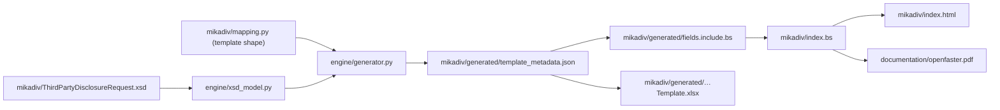
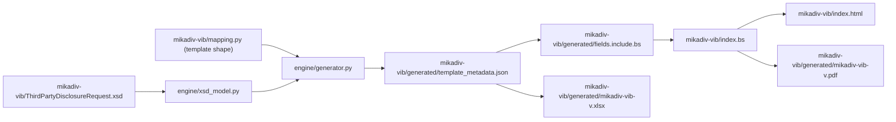

# MiKaDiv-VIB rename & site polish Implementation Plan

> **For agentic workers:** REQUIRED SUB-SKILL: Use superpowers:subagent-driven-development (recommended) or superpowers:executing-plans to implement this plan task-by-task. Steps use checkbox (`- [ ]`) syntax for tracking.

**Goal:** Rename MiKaDiv's slug to `mikadiv-vib` everywhere (including the live URL), trim
`/about` to genuinely family-wide content, add direct GitHub-raw downloads for the PDF/Excel,
version those filenames from a single source of truth, add an Excel "Meta" sheet, remove one
editor from every live document, and replace 404s with a safe redirect-to-root fallback.

**Architecture:** Nine sequential tasks. Task 1 does the mechanical directory/URL/Shortname
rename everything else builds on. Tasks 2-3 build the version-single-source-of-truth mechanism
and use it immediately (filenames, Meta sheet, download links). Task 4 depends on Task 3 having
already removed every live reference to the terms it deletes. Tasks 5-8 (routing, portal copy,
CI, README) are lower-risk and mostly independent of each other, sequenced last so they can
describe the truly final state. Task 9 is the merge-gated live verification.

**Tech Stack:** Python 3.12 (`openpyxl`, `xmlschema`), Bikeshed, WeasyPrint, GitHub Actions,
Vercel (`vercel.json`).

**Spec:** `docs/superpowers/specs/2026-08-25-mikadiv-vib-rename-and-site-polish-design.md`

## Global Constraints

- **Slug rename is total, including the public URL.** `mikadiv` becomes `mikadiv-vib`
  everywhere: directory name, Bikeshed `Shortname`, live URL (`/mikadiv` → `/mikadiv-vib`),
  every file/script/doc that references any of those. No redirect from the old `/mikadiv` is
  needed (never had external links).
- **Version single source of truth:** `mikadiv-vib/index.bs`'s `Text Macro: DOCVERSION` line is
  the only place the version string is hand-typed. Everything else (PDF filename, Excel
  filename, Excel Meta sheet, download links) reads it via `engine/version.py`'s
  `read_docversion()` — never hardcode a version string anywhere else.
- **Filenames:** PDF is `mikadiv-vib-v<version>.pdf`, Excel is `mikadiv-vib-v<version>.xlsx`,
  both written to `mikadiv-vib/generated/`. Download links use
  `raw.githubusercontent.com/OpenFASTER-Standard/spec/main/...` URLs, never a GitHub blob
  (`.../blob/...`) URL.
- **Excel "Meta" sheet is the LAST sheet** in the workbook, after `_Lists`.
- **`/about` is kept**, trimmed to: Introduction, Scope, Regulatory context, Versioning, and the
  `Certified Financial Intermediary` term only. Its "Planned work" section and its `disclosure`/
  `RequestId`/`paying agent`/`tax voucher` `<dfn>`s are removed, not relocated. Every
  `[[openfaster#term]]` cross-reference to those four terms — in `mikadiv-vib/index.bs`'s prose
  **and** in `engine/generator.py`'s hardcoded string — becomes plain unlinked text.
- **Editor removal:** `Alaa Eddine Cherif` is removed from `mikadiv-vib/index.bs` and
  `documentation/about.bs`. `docs/superpowers/plans/2026-08-24-site-structure-overview.md` (a
  dated, already-executed plan document) is explicitly NOT touched — it's a historical record.
- **404 handling:** a static `404.html` file at the repo root, NOT a `vercel.json` `redirects`
  catch-all (confirmed unsafe — see spec section 8's correction). `vercel.json`'s `/openfaster.pdf`
  rewrite is removed (downloads now go through GitHub raw links).
- **`--die-on=link-error` stays on** for every Bikeshed invocation.
- **Never hand-edit anything under `mikadiv-vib/generated/`** — only its source inputs
  (`ThirdPartyDisclosureRequest.xsd`, `mapping.py`, `mikadiv-vib/index.bs`'s own prose) are
  hand-edited.

---

### Task 1: Rename `mikadiv/` → `mikadiv-vib/`

**Files:**
- Rename (git mv): `mikadiv/` → `mikadiv-vib/` (carries `ThirdPartyDisclosureRequest.xsd`,
  `mapping.py`, `index.bs`, `generated/`, `header.include` along with it)
- Delete: `mikadiv-vib/__init__.py`
- Modify: `mikadiv-vib/index.bs` (metadata + one heading ID)
- Modify: `generate_template.py` (import mechanism, paths)
- Modify: `index.html:44`
- Modify: `documentation/about.bs:153`
- Modify: `documentation/prepare_spec.py` (`OUTPUTS` path + docstring)
- Modify: `documentation/header.template.include:7` (docstring comment only — this is the
  *source* template; its 3 regenerated `header.include` copies pick up the fix automatically
  once this task re-runs `prepare_spec.py`)
- Modify: `engine/__init__.py:6`
- Modify: `streamld/generator/shacl_model.py:1`
- Modify: `streamld/generator/generate_streamld_docs.py:2`

**Interfaces:**
- Produces: `mikadiv-vib/` as the module's directory (consumed by every later task), a
  `_load_module()` helper in `generate_template.py` that loads a hyphenated-directory Python
  file by path (Task 2 extends this same file, must preserve this helper).

- [ ] **Step 1: Rename the directory and drop the now-unnecessary `__init__.py`**

```bash
git mv mikadiv mikadiv-vib
git rm mikadiv-vib/__init__.py
```

`mikadiv-vib` (a hyphen) is not a valid Python package name, so `mikadiv-vib/__init__.py`
serving as package marker no longer makes sense — `generate_template.py` is about to stop
importing this directory as a package at all (Step 4).

- [ ] **Step 2: Fix `mikadiv-vib/index.bs`'s metadata and heading ID**

Open `mikadiv-vib/index.bs`. Change:

```
Shortname: mikadiv
```
to
```
Shortname: mikadiv-vib
```

Change:
```
URL: https://openfaster.org/mikadiv
```
to
```
URL: https://openfaster.org/mikadiv-vib
```

Change the module heading (and nothing else on that line):
```
The MiKaDiv Third-Party Disclosure module {#mikadiv-module}
```
to
```
The MiKaDiv Third-Party Disclosure module {#mikadiv-vib-module}
```
(Bikeshed regenerates its own table of contents and self-link from this heading ID
automatically — no other line in this file references `#mikadiv-module`, confirmed by
`grep -n "mikadiv-module" mikadiv-vib/index.bs` returning only this one heading line.)

- [ ] **Step 3: Fix `mikadiv-vib/index.bs`'s cross-reference to the source-schema section**

The `[[openfaster#paying-agent|paying agent]]` links and other cross-references are handled in
Task 3, not here — leave them as-is for now. This step only touches metadata/heading, already
done in Step 2.

- [ ] **Step 4: Rewrite `generate_template.py`'s import mechanism**

Replace the entire file with:

```python
"""Build entry point for the OpenFASTER templates and documentation.

Wires the shared generation engine (:mod:`engine`) to each module's schema and
template mapping, and generates that module's Excel workbook, metadata store,
field reference and Bikeshed include into the module's ``generated/`` folder.

Field-level content is machine-sourced from each module's XSD; the template
shape lives in the module's ``mapping.py``. Add a new module by appending a
``ModuleConfig`` to ``MODULES`` below.

Run from the repository root::

    python generate_template.py
"""

from __future__ import annotations

import importlib.util
from pathlib import Path
from types import ModuleType

from engine.generator import Generator, ModuleConfig

ROOT = Path(__file__).resolve().parent


def _load_module(name: str, path: Path) -> ModuleType:
    """Load a module by file path.

    Module directories use hyphenated slugs (e.g. ``mikadiv-vib/``) to match
    their live URL path, which isn't a valid Python package name -- so
    mapping modules are loaded directly by path rather than imported as
    ``package.submodule``.
    """
    spec = importlib.util.spec_from_file_location(name, path)
    assert spec is not None and spec.loader is not None
    module = importlib.util.module_from_spec(spec)
    spec.loader.exec_module(module)
    return module


mikadiv_vib_mapping = _load_module("mikadiv_vib_mapping", ROOT / "mikadiv-vib" / "mapping.py")

MODULES: list[ModuleConfig] = [
    ModuleConfig(
        title=mikadiv_vib_mapping.LEGEND_TITLE,
        xsd_path=ROOT / "mikadiv-vib" / "ThirdPartyDisclosureRequest.xsd",
        output_dir=ROOT / "mikadiv-vib" / "generated",
        xlsx_name="MiKaDiv_ThirdPartyDisclosure_Template.xlsx",
        json_name="template_metadata.json",
        doc_name="TEMPLATE_FIELDS.md",
        bs_name="fields.include.bs",
        legend_sheet_name=mikadiv_vib_mapping.S_LEGEND,
        master_sheet_name=mikadiv_vib_mapping.S_MASTER,
        sheet_order=mikadiv_vib_mapping.SHEET_ORDER,
        build_enums=mikadiv_vib_mapping.build_enums,
        build_sheets=mikadiv_vib_mapping.build_sheets,
        sheet_info=mikadiv_vib_mapping.SHEET_INFO,
        legend_rows=mikadiv_vib_mapping.LEGEND_ROWS,
    ),
]


def main() -> None:
    for config in MODULES:
        Generator(config).run()


if __name__ == "__main__":
    main()
```

Note `xlsx_name` is deliberately left as the OLD filename here — Task 2 changes it to the
versioned name. This task is a pure rename with no behavior change beyond location.

- [ ] **Step 5: Fix the root portal's link**

In `index.html`, change:
```html
<span class="of-portal-item-name"><a href="/mikadiv">MiKaDiv Third-Party Disclosure</a></span>
```
to
```html
<span class="of-portal-item-name"><a href="/mikadiv-vib">MiKaDiv Third-Party Disclosure</a></span>
```

- [ ] **Step 6: Fix `about.bs`'s prose example**

In `documentation/about.bs`, change:
```
publishes at a single, stable "latest" URL (e.g. `/mikadiv`, `/streamld`),
```
to
```
publishes at a single, stable "latest" URL (e.g. `/mikadiv-vib`, `/streamld`),
```

- [ ] **Step 7: Fix `documentation/prepare_spec.py`'s header-sync path**

Change:
```python
Bikeshed's `Local Boilerplate: header yes` resolves relative to each `.bs`
source file's own directory, so this shared shell needs a byte-identical copy
in each of the three directories that reference it (documentation/, mikadiv/,
streamld/) or Bikeshed silently falls back to stock boilerplate. All three
copies are regenerated here from the same merged content.
```
to
```
Bikeshed's `Local Boilerplate: header yes` resolves relative to each `.bs`
source file's own directory, so this shared shell needs a byte-identical copy
in each of the three directories that reference it (documentation/, mikadiv-vib/,
streamld/) or Bikeshed silently falls back to stock boilerplate. All three
copies are regenerated here from the same merged content.
```

And change:
```python
OUTPUTS = (
    ROOT / "header.include",
    ROOT.parent / "mikadiv" / "header.include",
    ROOT.parent / "streamld" / "header.include",
)
```
to
```python
OUTPUTS = (
    ROOT / "header.include",
    ROOT.parent / "mikadiv-vib" / "header.include",
    ROOT.parent / "streamld" / "header.include",
)
```

This is functionally important, not cosmetic: without this fix, `mikadiv-vib/header.include`
would stop being regenerated on future header/changelog edits — the exact "silent shell
divergence" bug the previous sub-project's final review already found and fixed once, for the
old `mikadiv/` path.

- [ ] **Step 8: Fix the remaining docstring-only comments**

In `documentation/header.template.include`, change line 7's `mikadiv/` to `mikadiv-vib/` (same
sentence as Step 7's `prepare_spec.py` docstring — this file is the template `prepare_spec.py`
reads from).

In `engine/__init__.py`, change:
```python
module package (e.g. ``mikadiv``), never here.
```
to
```python
module package (e.g. ``mikadiv-vib``), never here.
```

In `streamld/generator/shacl_model.py`, change line 1's `mikadiv/` to `mikadiv-vib/`.

In `streamld/generator/generate_streamld_docs.py`, change line 2's `mikadiv/` to `mikadiv-vib/`.

- [ ] **Step 9: Regenerate and verify**

```bash
source .venv312/bin/activate   # or your own venv with requirements.txt + documentation/requirements-spec.txt installed
python generate_template.py
python documentation/prepare_spec.py
bikeshed --allow-nonlocal-files --die-on=link-error spec mikadiv-vib/index.bs mikadiv-vib/index.html
```

Expected: all three commands exit 0. Confirm the rebuilt HTML has the new canonical URL:

```bash
grep -o 'rel="canonical"[^>]*' mikadiv-vib/index.html
```

Expected output contains `href="https://openfaster.org/mikadiv-vib"`.

Confirm the 3 header.include copies are still byte-identical:

```bash
md5sum documentation/header.include mikadiv-vib/header.include streamld/header.include
```

Expected: all three hashes match.

- [ ] **Step 10: Commit**

```bash
git add -A
git commit -m "refactor: rename mikadiv/ -> mikadiv-vib/, including the live URL and Shortname"
```

---

### Task 2: Version single source of truth + Excel filename + Meta sheet

**Files:**
- Create: `engine/version.py`
- Modify: `engine/generator.py` (`ModuleConfig` fields, `_build_meta` method, `run()` wiring)
- Modify: `generate_template.py` (version parsing, `xlsx_name`, new `ModuleConfig` fields)
- Rename (via regeneration): `mikadiv-vib/generated/MiKaDiv_ThirdPartyDisclosure_Template.xlsx`
  → `mikadiv-vib/generated/mikadiv-vib-v1.0.0.xlsx`

**Interfaces:**
- Consumes: `mikadiv-vib/index.bs`'s `Text Macro: DOCVERSION` line (Task 1's renamed file).
- Produces: `engine.version.read_docversion(bs_path: Path) -> str`, consumed by Task 7 (CI
  workflow) and README's documented build sequence (Task 8). `ModuleConfig` gains `slug: str`,
  `version: str`, `spec_url: str` fields, consumed by Task 3 (download-link filenames must match
  what this task produces).

- [ ] **Step 1: Write `engine/version.py`**

```python
"""Parses a module's canonical version out of its Bikeshed source.

The ``Text Macro: DOCVERSION`` line in a module's own ``.bs`` file is the
single source of truth for that module's version. Everywhere else that needs
it (Excel/PDF filenames, the Excel Meta sheet, CI) reads it from here rather
than keeping an independent copy that could drift.
"""

from __future__ import annotations

import re
import sys
from pathlib import Path

_DOCVERSION_RE = re.compile(r"^Text Macro: DOCVERSION (\S+)$", re.MULTILINE)


def read_docversion(bs_path: Path) -> str:
    """Return the DOCVERSION text macro's value from a Bikeshed ``.bs`` file.

    Raises ``ValueError`` if the file has no ``Text Macro: DOCVERSION`` line.
    """
    text = bs_path.read_text(encoding="utf-8")
    match = _DOCVERSION_RE.search(text)
    if match is None:
        raise ValueError(f"No 'Text Macro: DOCVERSION' line found in {bs_path}")
    return match.group(1)


if __name__ == "__main__":
    print(read_docversion(Path(sys.argv[1])))
```

- [ ] **Step 2: Verify it works standalone**

```bash
python -m engine.version mikadiv-vib/index.bs
```

Expected output: `1.0.0`

- [ ] **Step 3: Add `slug`/`version`/`spec_url` to `ModuleConfig` and a `_build_meta` method**

In `engine/generator.py`, find the `ModuleConfig` dataclass:

```python
@dataclass
class ModuleConfig:
    """Everything the engine needs to generate one OpenFASTER module."""

    title: str
    xsd_path: Path
    output_dir: Path
    xlsx_name: str
    json_name: str
    doc_name: str
    bs_name: str
    legend_sheet_name: str
    master_sheet_name: str
    sheet_order: list[str]
    build_enums: Callable[[XsdModel], tuple[dict[str, list[str]], dict[str, dict[str, str]]]]
    build_sheets: Callable[[XsdModel], dict[str, list[tuple]]]
    sheet_info: dict[str, dict[str, str]]
    legend_rows: list[tuple[str, str]]
    link_key: str = "RequestId"
```

Add three new fields right before `link_key` (fields without a default must come before any
field that has one):

```python
@dataclass
class ModuleConfig:
    """Everything the engine needs to generate one OpenFASTER module."""

    title: str
    xsd_path: Path
    output_dir: Path
    xlsx_name: str
    json_name: str
    doc_name: str
    bs_name: str
    legend_sheet_name: str
    master_sheet_name: str
    sheet_order: list[str]
    build_enums: Callable[[XsdModel], tuple[dict[str, list[str]], dict[str, dict[str, str]]]]
    build_sheets: Callable[[XsdModel], dict[str, list[tuple]]]
    sheet_info: dict[str, dict[str, str]]
    legend_rows: list[tuple[str, str]]
    slug: str
    version: str
    spec_url: str
    link_key: str = "RequestId"
```

Find `_build_legend` (used as the style reference for the new method):

```python
    def _build_legend(self, ws) -> None:
        ws.column_dimensions["A"].width = 42
        ws.column_dimensions["B"].width = 110

        title = ws.cell(row=1, column=1, value=self.c.title)
        title.font = Font(bold=True, color="1F4E78", size=14)
        ws.cell(row=1, column=2, value=f"Generated from {self.c.xsd_path.name}").font = Font(
            italic=True, color="808080", size=9
        )

        for offset, (label, value) in enumerate(self.c.legend_rows, start=3):
            is_heading = label != "" and value == ""
            label_cell = ws.cell(row=offset, column=1, value=label)
            value_cell = ws.cell(row=offset, column=2, value=value)
            value_cell.alignment = WRAP_TOP
            if is_heading:
                label_cell.font = Font(bold=True, color="FFFFFF", size=11)
                label_cell.fill = PatternFill("solid", fgColor="2E75B6")
            else:
                label_cell.font = Font(bold=True, color="1F3864", size=10)
                label_cell.alignment = Alignment(vertical="top")

        ws.freeze_panes = "A3"
```

Add a new `_build_meta` method directly after it:

```python
    def _build_meta(self, ws) -> None:
        ws.column_dimensions["A"].width = 20
        ws.column_dimensions["B"].width = 60

        rows = [
            ("Standard", self.c.title),
            ("Slug", self.c.slug),
            ("Version", self.c.version),
            ("Spec URL", self.c.spec_url),
        ]
        for offset, (label, value) in enumerate(rows, start=1):
            label_cell = ws.cell(row=offset, column=1, value=label)
            label_cell.font = Font(bold=True, color="1F3864", size=10)
            ws.cell(row=offset, column=2, value=value)
```

- [ ] **Step 4: Create the Meta sheet last, in `run()`**

Find:

```python
        lists_ws.sheet_state = "hidden"
        wb.move_sheet(lists_ws, offset=len(wb.sheetnames) - 1 - wb.sheetnames.index("_Lists"))
        wb.active = wb.sheetnames.index(self.c.master_sheet_name)

        xlsx_path = self.c.output_dir / self.c.xlsx_name
```

Change to:

```python
        lists_ws.sheet_state = "hidden"
        wb.move_sheet(lists_ws, offset=len(wb.sheetnames) - 1 - wb.sheetnames.index("_Lists"))
        wb.active = wb.sheetnames.index(self.c.master_sheet_name)

        meta_ws = wb.create_sheet("Meta")
        self._build_meta(meta_ws)

        xlsx_path = self.c.output_dir / self.c.xlsx_name
```

`wb.create_sheet(title)` with no explicit index appends to the end of the workbook by default —
since this call happens after every other sheet (including `_Lists`) already exists, "Meta"
lands truly last with no extra `move_sheet` call needed.

- [ ] **Step 5: Wire the version helper and new fields into `generate_template.py`**

Replace the whole file with:

```python
"""Build entry point for the OpenFASTER templates and documentation.

Wires the shared generation engine (:mod:`engine`) to each module's schema and
template mapping, and generates that module's Excel workbook, metadata store,
field reference and Bikeshed include into the module's ``generated/`` folder.

Field-level content is machine-sourced from each module's XSD; the template
shape lives in the module's ``mapping.py``. Add a new module by appending a
``ModuleConfig`` to ``MODULES`` below.

Run from the repository root::

    python generate_template.py
"""

from __future__ import annotations

import importlib.util
from pathlib import Path
from types import ModuleType

from engine.generator import Generator, ModuleConfig
from engine.version import read_docversion

ROOT = Path(__file__).resolve().parent


def _load_module(name: str, path: Path) -> ModuleType:
    """Load a module by file path.

    Module directories use hyphenated slugs (e.g. ``mikadiv-vib/``) to match
    their live URL path, which isn't a valid Python package name -- so
    mapping modules are loaded directly by path rather than imported as
    ``package.submodule``.
    """
    spec = importlib.util.spec_from_file_location(name, path)
    assert spec is not None and spec.loader is not None
    module = importlib.util.module_from_spec(spec)
    spec.loader.exec_module(module)
    return module


mikadiv_vib_mapping = _load_module("mikadiv_vib_mapping", ROOT / "mikadiv-vib" / "mapping.py")
MIKADIV_VIB_VERSION = read_docversion(ROOT / "mikadiv-vib" / "index.bs")

MODULES: list[ModuleConfig] = [
    ModuleConfig(
        title=mikadiv_vib_mapping.LEGEND_TITLE,
        xsd_path=ROOT / "mikadiv-vib" / "ThirdPartyDisclosureRequest.xsd",
        output_dir=ROOT / "mikadiv-vib" / "generated",
        xlsx_name=f"mikadiv-vib-v{MIKADIV_VIB_VERSION}.xlsx",
        json_name="template_metadata.json",
        doc_name="TEMPLATE_FIELDS.md",
        bs_name="fields.include.bs",
        legend_sheet_name=mikadiv_vib_mapping.S_LEGEND,
        master_sheet_name=mikadiv_vib_mapping.S_MASTER,
        sheet_order=mikadiv_vib_mapping.SHEET_ORDER,
        build_enums=mikadiv_vib_mapping.build_enums,
        build_sheets=mikadiv_vib_mapping.build_sheets,
        sheet_info=mikadiv_vib_mapping.SHEET_INFO,
        legend_rows=mikadiv_vib_mapping.LEGEND_ROWS,
        slug="mikadiv-vib",
        version=MIKADIV_VIB_VERSION,
        spec_url="https://openfaster.org/mikadiv-vib",
    ),
]


def main() -> None:
    for config in MODULES:
        Generator(config).run()


if __name__ == "__main__":
    main()
```

- [ ] **Step 6: Regenerate and verify**

```bash
python generate_template.py
```

Expected: prints `Wrote .../mikadiv-vib/generated/mikadiv-vib-v1.0.0.xlsx with sheets: ...`.

Verify the Meta sheet is last and has correct content:

```bash
python3 -c "
from openpyxl import load_workbook
wb = load_workbook('mikadiv-vib/generated/mikadiv-vib-v1.0.0.xlsx')
print('sheets:', wb.sheetnames)
assert wb.sheetnames[-1] == 'Meta', 'Meta must be the last sheet'
ws = wb['Meta']
rows = [(ws.cell(r, 1).value, ws.cell(r, 2).value) for r in range(1, 5)]
print('meta rows:', rows)
assert rows[2] == ('Version', '1.0.0')
assert rows[3] == ('Spec URL', 'https://openfaster.org/mikadiv-vib')
print('OK')
"
```

Expected: prints `OK` with no assertion errors.

- [ ] **Step 7: Remove the stale old-named artifact**

```bash
git rm mikadiv-vib/generated/MiKaDiv_ThirdPartyDisclosure_Template.xlsx
git add mikadiv-vib/generated/mikadiv-vib-v1.0.0.xlsx engine/version.py engine/generator.py generate_template.py
```

- [ ] **Step 8: Commit**

```bash
git commit -m "feat: version single source of truth + versioned Excel filename + Meta sheet"
```

---

### Task 3: Download section + de-link 4 terms + remove Editor Alaa in `mikadiv-vib/index.bs`

**Files:**
- Modify: `mikadiv-vib/index.bs`
- Modify: `engine/generator.py` (one hardcoded string in `_write_bikeshed_include`)
- Regenerate: `mikadiv-vib/generated/fields.include.bs` (via `generate_template.py`)

**Interfaces:**
- Consumes: `mikadiv-vib-v[DOCVERSION].{pdf,xlsx}` filenames established in Task 2 (via
  Bikeshed's own `[DOCVERSION]` text-macro substitution, confirmed to work inline in a link
  `href` — no Python-side templating needed here).

- [ ] **Step 1: Fix `engine/generator.py`'s hardcoded cross-reference**

Find, in `_write_bikeshed_include`:

```python
        add(
            "<p>The following field-level definitions are generated from "
            f"<code>{esc(metadata['generatedFrom'])}</code>. Each group below "
            "corresponds to one sheet of the accompanying Excel template. The "
            f"<code>{esc(metadata['linkKey'])}</code> column links the groups "
            "of a single [[openfaster#disclosure|disclosure]] together.</p>"
        )
```

Change the last line to:

```python
        add(
            "<p>The following field-level definitions are generated from "
            f"<code>{esc(metadata['generatedFrom'])}</code>. Each group below "
            "corresponds to one sheet of the accompanying Excel template. The "
            f"<code>{esc(metadata['linkKey'])}</code> column links the groups "
            "of a single disclosure together.</p>"
        )
```

- [ ] **Step 2: Regenerate `fields.include.bs`**

```bash
python generate_template.py
git diff mikadiv-vib/generated/fields.include.bs
```

Expected: the diff shows exactly one line changed (the `[[openfaster#disclosure|disclosure]]`
→ `disclosure` text), nothing else.

- [ ] **Step 3: Remove the Editor line**

In `mikadiv-vib/index.bs`, delete this line entirely:

```
Editor: Alaa Eddine Cherif, https://github.com/AlaaCherif
```

- [ ] **Step 4: Remove the now-unused biblio block**

The 4 terms de-linked in Step 6 below were the only things this document cross-referenced via
`[[openfaster#...]]`. Once they're gone, the `<pre class=biblio>` block declaring the
`"openfaster"` shortname is dead. Delete it entirely:

```
<pre class=biblio>
{
  "openfaster": {
    "title": "About OpenFASTER",
    "href": "https://openfaster.org/about",
    "publisher": "OpenFASTER"
  }
}
</pre>
```

(The Abstract's `<a href="/about">OpenFASTER</a>` link is a plain HTML link, not a Bikeshed
`[[...]]` autolink — it needs no biblio entry and is unaffected by this deletion.)

- [ ] **Step 5: Add the Downloads section**

Directly after the (now-deleted) biblio block's former position, and directly before `The
MiKaDiv Third-Party Disclosure module {#mikadiv-vib-module}`, insert:

```
Downloads {#downloads}
=======================

<a href="https://raw.githubusercontent.com/OpenFASTER-Standard/spec/main/mikadiv-vib/generated/mikadiv-vib-v[DOCVERSION].pdf">Specification PDF</a> ·
<a href="https://raw.githubusercontent.com/OpenFASTER-Standard/spec/main/mikadiv-vib/generated/mikadiv-vib-v[DOCVERSION].xlsx">Excel template</a>

```

`[DOCVERSION]` is Bikeshed's own text-macro substitution (already declared in this file's
metadata, `Text Macro: DOCVERSION 1.0.0`) — it resolves inline in a link `href` exactly like it
does in the existing `!This version:` metadata line, so the built HTML will contain the real
version number with no separate Python-side templating needed.

- [ ] **Step 6: Update the intro paragraph to remove the old blob link**

Find:

```
The MiKaDiv (§45b EStG) **third-party disclosure** module defines the data
required to describe a capital-income event, the securities involved, every
party in the chain, and the receipts and deliveries that support a
first-in-first-out (FIFO) determination.

An accompanying self-documenting Excel template is published alongside this
specification:
[MiKaDiv Third-Party Disclosure Template](https://github.com/OpenFASTER-Standard/spec/blob/main/mikadiv/generated/MiKaDiv_ThirdPartyDisclosure_Template.xlsx).
Each sheet mirrors one logical group below; every field carries its English
description, type constraints, and requiredness in the header rows.
```

Replace with:

```
The MiKaDiv (§45b EStG) **third-party disclosure** module defines the data
required to describe a capital-income event, the securities involved, every
party in the chain, and the receipts and deliveries that support a
first-in-first-out (FIFO) determination. An accompanying self-documenting
Excel template is published alongside this specification (see
[[#downloads|Downloads]] above); each sheet mirrors one logical group below,
with every field's English description, type constraints, and requiredness in
the header rows.
```

- [ ] **Step 7: De-link the 6 cross-references**

In the "Source schema" section, change:
```
third-party disclosure data between banks and towards the German
[[openfaster#paying-agent|paying agent]].
```
to
```
third-party disclosure data between banks and towards the German paying
agent.
```

In "Data model", change:
```
A [[openfaster#disclosure|disclosure]] is decomposed into several
logical groups (rendered as separate sheets in the Excel template). Every
group carries the [[openfaster#requestid|RequestId]] so that the
groups can be recombined into one record.
```
to
```
A disclosure is decomposed into several
logical groups (rendered as separate sheets in the Excel template). Every
group carries the RequestId so that the
groups can be recombined into one record.
```

In the data-model table, change:
```
    <tr><td>Tax Voucher Individuals / Legal Persons<td>up to 2 receivers total<td>The recipients of the [[openfaster#tax-voucher|tax voucher]].
```
to
```
    <tr><td>Tax Voucher Individuals / Legal Persons<td>up to 2 receivers total<td>The recipients of the tax voucher.
```

Change:
```
When the raw ledger is supplied, the German
[[openfaster#paying-agent|paying agent]] performs the FIFO
determination; when the submitter applies FIFO itself, the reduced trades are
supplied directly.
```
to
```
When the raw ledger is supplied, the German paying agent performs the FIFO
determination; when the submitter applies FIFO itself, the reduced trades are
supplied directly.
```

In "Linking model", change:
```
The [[openfaster#requestid|RequestId]] is the key on the *Requests
Master* group and the first column of every other group. Because it is used
only to join the groups, any value that is unique within a submission works.
```
to
```
The RequestId is the key on the *Requests
Master* group and the first column of every other group. Because it is used
only to join the groups, any value that is unique within a submission works.
```

- [ ] **Step 8: Build verification**

```bash
bikeshed --allow-nonlocal-files --die-on=link-error spec mikadiv-vib/index.bs mikadiv-vib/index.html
```

Expected: exit 0, zero warnings about missing biblio entries or link errors.

```bash
grep -c "openfaster#" mikadiv-vib/index.bs
```

Expected: `0` (no more cross-doc references anywhere in the file).

```bash
grep -o 'href="https://raw.githubusercontent.com/OpenFASTER-Standard/spec/main/mikadiv-vib/generated/mikadiv-vib-v[^"]*"' mikadiv-vib/index.html
```

Expected: two lines, one ending in `.pdf"` and one in `.xlsx"`, both containing `v1.0.0` (the
substituted `[DOCVERSION]` value).

- [ ] **Step 9: Commit**

```bash
git add mikadiv-vib/index.bs mikadiv-vib/index.html mikadiv-vib/generated/fields.include.bs engine/generator.py
git commit -m "feat: add download section, de-link 4 MiKaDiv-specific terms, remove editor"
```

---

### Task 4: Trim `about.bs` to family-wide content only

**Files:**
- Modify: `documentation/about.bs`

**Interfaces:**
- Consumes: Task 3 having already removed every live `[[openfaster#term]]` reference to the 4
  terms this task deletes — this task is only safe to run after Task 3.

- [ ] **Step 1: Remove the Editor line**

Delete:
```
Editor: Alaa Eddine Cherif, https://github.com/AlaaCherif
```

- [ ] **Step 2: Trim the Terminology section to CFI only**

Find:

```
Terminology {#terminology}
==========================

<dfn>Certified Financial Intermediary</dfn> (CFI)
: A regulated party — such as a bank, custodian, or central securities
    depository — that participates in withholding-tax and dividend reporting and
    exchanges disclosure data with other participants.

A <dfn>disclosure</dfn>
: One complete third-party disclosure record for a single capital-income event,
    identified and linked together by a single [=RequestId=].

<dfn>RequestId</dfn>
: The identifier that ties together all parts of one [=disclosure=]. It is a
    linking key only: any value that is unique within the submission is valid, so
    it need not be a UUID.

<dfn>paying agent</dfn>
: The German institution responsible for the withholding-tax reporting for a
    given capital-income event.

<dfn>tax voucher</dfn>
: The tax certificate (Steuerbescheinigung) issued in respect of a
    capital-income event.
```

Replace with:

```
Terminology {#terminology}
==========================

<dfn>Certified Financial Intermediary</dfn> (CFI)
: A regulated party — such as a bank, custodian, or central securities
    depository — that participates in withholding-tax and dividend reporting and
    exchanges disclosure data with other participants.
```

- [ ] **Step 3: Remove the "Planned work" section entirely**

Find and delete this whole block (from the `Planned work {#roadmap}` heading through the end of
the "UUID return format" subsection, immediately before `Versioning {#versioning}`):

```
Planned work {#roadmap}
=======================

The following modules and improvements are planned. They are <em>not</em> part of
the normative content of any published module yet; they are recorded here to
describe the intended direction of the OpenFASTER family.

Bulk disclosure template {#roadmap-bulk}
----------------------------------------

A revised template (and matching schema) in which an arbitrary number of
beneficiaries, income lines, and related records can be entered, enabling
mass/batch processing of disclosures rather than one disclosure at a time.

Published multilingual vocabulary {#roadmap-vocabulary}
-------------------------------------------------------

A published <em>vocabulary</em> that fixes the (non-official) translations of the
field names and their explanations into several languages, each validated by
appropriate domain experts. This lets institutions across jurisdictions work
against a shared, authoritative set of terms while the official German schema
remains the legal reference.

UUID return format {#roadmap-uuid-return}
-----------------------------------------

A format (an XSD plus an equivalent Excel representation) with which a reporting
entity — for example Clearstream, or another reporting party — can report the
assigned UUIDs back to the foreign banks that originated the disclosures, closing
the loop between submission and acknowledgement.

```

Do not replace it with anything — the section is dropped, not relocated. `Versioning
{#versioning}` becomes the next section after "Terminology".

- [ ] **Step 4: Build verification**

```bash
bikeshed --allow-nonlocal-files --die-on=link-error spec documentation/about.bs documentation/about.html
```

Expected: exit 0, zero link errors, and — since `disclosure`/`RequestId`/`paying agent`/`tax
voucher` no longer exist as `<dfn>`s at all — the previously-seen `Unexported dfn for 'paying
agent'`/`'tax voucher'` warnings (harmless but present before this change, confirmed via the
`generate_template.py` output history) are gone too:

```bash
bikeshed --allow-nonlocal-files --die-on=link-error spec documentation/about.bs /tmp/about-check.html 2>&1 | grep -i "unexported dfn"
```

Expected: no output (the warnings no longer occur, since the removed dfns no longer exist to be
unexported).

- [ ] **Step 5: Commit**

```bash
git add documentation/about.bs documentation/about.html
git commit -m "fix: trim about.bs to genuinely family-wide content only"
```

---

### Task 5: Safe 404 fallback + `vercel.json` cleanup

**Files:**
- Create: `404.html`
- Modify: `vercel.json`

**Interfaces:** none (routing-only, no code interfaces).

- [ ] **Step 1: Write `404.html`**

```html
<!DOCTYPE html>
<html lang="en">
<head>
  <meta charset="utf-8">
  <title>OpenFASTER</title>
  <meta http-equiv="refresh" content="0;url=/">
  <script>window.location.replace("/");</script>
</head>
<body>
  <p>Page not found. Redirecting to <a href="/">openfaster.org</a>…</p>
</body>
</html>
```

Vercel serves this file only as a genuine last-resort fallback — after real files,
directory-index resolution, `rewrites`, and `redirects` have all failed to match — so it can
never shadow an existing page (confirmed via Vercel's own documented behavior; see the design
spec's section 8 correction for the research trail). The inline `<script>` redirects
immediately for JS-enabled clients; the `<meta http-equiv="refresh">` is a fallback for
non-JS clients and crawlers.

- [ ] **Step 2: Remove the now-redundant PDF rewrite from `vercel.json`**

Current content:

```json
{
  "cleanUrls": true,
  "trailingSlash": false,
  "rewrites": [
    { "source": "/openfaster.pdf", "destination": "/documentation/openfaster.pdf" },
    { "source": "/about", "destination": "/documentation/about" }
  ]
}
```

New content:

```json
{
  "cleanUrls": true,
  "trailingSlash": false,
  "rewrites": [
    { "source": "/about", "destination": "/documentation/about" }
  ]
}
```

- [ ] **Step 3: Verify `vercel.json` is valid JSON**

```bash
python3 -c "import json; json.load(open('vercel.json')); print('valid')"
```

Expected: prints `valid`.

- [ ] **Step 4: Commit**

```bash
git add 404.html vercel.json
git commit -m "feat: add safe 404->root fallback, drop redundant PDF rewrite"
```

---

### Task 6: Root portal copy

**Files:**
- Modify: `index.html`

**Interfaces:** none.

- [ ] **Step 1: Rewrite the lede paragraph**

Find:

```html
  <p class="of-portal-lede">
    OpenFASTER is a vendor-independent family of open standards for EU
    withholding-tax and dividend-reporting data exchange under MiKaDiv and
    FASTER. See <a href="/about">About OpenFASTER</a> for scope, terminology,
    and versioning policy.
  </p>
```

Replace with:

```html
  <p class="of-portal-lede">
    OpenFASTER is a vendor-independent family of open standards for the
    harmonized data exchange of regulatory reporting, tax compliance and
    audit data, starting with MiKaDiv and FASTER. See
    <a href="/about">About OpenFASTER</a> for scope, terminology, and
    versioning policy.
  </p>
```

(Only the first sentence's wording changes — the pointer to `/about` stays, since `/about` is
being kept, not removed.)

- [ ] **Step 2: Commit**

```bash
git add index.html
git commit -m "docs: broaden root portal's lede to cover regulatory reporting generally"
```

---

### Task 7: CI workflow updates

**Files:**
- Modify: `.github/workflows/spec.yml`

**Interfaces:**
- Consumes: `engine.version.read_docversion` (Task 2, invoked via `python -m engine.version`),
  `mikadiv-vib/` paths (Task 1).

- [ ] **Step 1: Rewrite the MiKaDiv build step and add a version-read step**

Find:

```yaml
      - name: Build MiKaDiv (XSD -> generated include -> Excel template)
        run: python generate_template.py

      - name: Build StreamLD (SHACL -> generated include + JSON Schema)
        run: PYTHONPATH=streamld python -m generator.generate_streamld_docs

      - name: Regenerate header boilerplate (embeds the changelog)
        run: python documentation/prepare_spec.py

      - name: Build documentation/about.html
        run: bikeshed --allow-nonlocal-files --die-on=link-error spec documentation/about.bs documentation/about.html

      - name: Build mikadiv/index.html + PDF
        run: |
          bikeshed --allow-nonlocal-files --die-on=link-error spec mikadiv/index.bs mikadiv/index.html
          weasyprint --stylesheet documentation/print.css mikadiv/index.html documentation/openfaster.pdf
```

Replace with:

```yaml
      - name: Build MiKaDiv-VIB (XSD -> generated include -> Excel template)
        run: python generate_template.py

      - name: Build StreamLD (SHACL -> generated include + JSON Schema)
        run: PYTHONPATH=streamld python -m generator.generate_streamld_docs

      - name: Regenerate header boilerplate (embeds the changelog)
        run: python documentation/prepare_spec.py

      - name: Build documentation/about.html
        run: bikeshed --allow-nonlocal-files --die-on=link-error spec documentation/about.bs documentation/about.html

      - name: Read MiKaDiv-VIB version
        id: mikadiv_vib_version
        run: echo "version=$(python -m engine.version mikadiv-vib/index.bs)" >> "$GITHUB_OUTPUT"

      - name: Build mikadiv-vib/index.html + PDF
        run: |
          bikeshed --allow-nonlocal-files --die-on=link-error spec mikadiv-vib/index.bs mikadiv-vib/index.html
          weasyprint --stylesheet documentation/print.css mikadiv-vib/index.html mikadiv-vib/generated/mikadiv-vib-v${{ steps.mikadiv_vib_version.outputs.version }}.pdf
```

- [ ] **Step 2: Fix the `git add` list in the commit step**

Find:

```yaml
          git add index.html mikadiv/index.html mikadiv/generated/ documentation/about.html documentation/header.include mikadiv/header.include streamld/header.include documentation/openfaster.pdf streamld/index.html streamld/core.html streamld/subscription.html streamld/binding-sse.html streamld/binding-websocket.html streamld/generated/
```

Replace with:

```yaml
          git add index.html 404.html mikadiv-vib/index.html mikadiv-vib/generated/ documentation/about.html documentation/header.include mikadiv-vib/header.include streamld/header.include streamld/index.html streamld/core.html streamld/subscription.html streamld/binding-sse.html streamld/binding-websocket.html streamld/generated/
```

(`documentation/openfaster.pdf` is dropped — the PDF now lives under `mikadiv-vib/generated/`,
already covered by that directory's own `git add` entry. `404.html` is added since it's a new
hand-authored file that could theoretically be touched by a future automated pass, though today
it never changes on rebuild — including it in the list is a no-op unless it actually changes,
consistent with how `index.html` is already handled per this workflow's existing convention.)

- [ ] **Step 3: Local dry-run of every changed command**

```bash
python -m engine.version mikadiv-vib/index.bs
```

Expected: `1.0.0`

```bash
VERSION=$(python -m engine.version mikadiv-vib/index.bs)
weasyprint --stylesheet documentation/print.css mikadiv-vib/index.html mikadiv-vib/generated/mikadiv-vib-v${VERSION}.pdf
ls -la mikadiv-vib/generated/mikadiv-vib-v${VERSION}.pdf
```

Expected: the `ls` succeeds, file exists with nonzero size.

- [ ] **Step 4: Commit**

```bash
git add .github/workflows/spec.yml
git commit -m "fix: update CI workflow for mikadiv-vib rename and versioned PDF filename"
```

- [ ] **Step 5: Real live CI verification (before merging to `main`)**

This is real, live verification — not written-and-assumed. Push a throwaway branch, open a PR
against `main`, and confirm the workflow runs green:

```bash
git checkout -b verify-ci-mikadiv-vib
git push -u origin verify-ci-mikadiv-vib
gh pr create --repo OpenFASTER-Standard/spec --base main --head verify-ci-mikadiv-vib \
  --title "CI verification: mikadiv-vib rename" --body "Throwaway PR to verify CI green after the mikadiv-vib rename. Will be closed, not merged."
```

Watch the run to completion (`gh run watch <run-id> --repo OpenFASTER-Standard/spec
--exit-status`). Confirm: every build step succeeds, `pytest streamld/tests/` passes, and the
"Commit regenerated output" step is skipped (correct — this is a `pull_request` event, not a
`push` to `main`).

Once confirmed green, close the PR and delete the throwaway branch (do not merge it — this
verification runs on the feature branch itself, which will be merged as a whole once all 9
tasks and the final review are complete):

```bash
gh pr close <PR_NUMBER> --repo OpenFASTER-Standard/spec --delete-branch
```

Then switch back to the feature branch this plan is running on before continuing to Task 8.

---

### Task 8: `README.md` accuracy pass

**Files:**
- Modify: `README.md`

**Interfaces:** none (documentation only).

- [ ] **Step 1: Fix the repository-layout tree**

Find the tree block (from `` ```  `` to `` ``` ``) and replace it with:

```
├── engine/                        # shared, module-agnostic generator
│   ├── xsd_model.py               #   Layer 1: XSD extractor (via xmlschema)
│   ├── generator.py               #   Layer 3: renders workbook + docs + include
│   └── version.py                 #   reads a module's canonical version from its .bs source
├── mikadiv-vib/                   # the MiKaDiv Third-Party Disclosure module
│   ├── ThirdPartyDisclosureRequest.xsd   # schema (machine source of truth)
│   ├── mapping.py                 #   Layer 2: template shape for this module
│   ├── index.bs                   #   Bikeshed source; built to index.html, served at /mikadiv-vib
│   └── generated/                 #   generated artifacts (do not edit by hand)
│       ├── mikadiv-vib-v<version>.xlsx
│       ├── mikadiv-vib-v<version>.pdf
│       ├── template_metadata.json
│       ├── TEMPLATE_FIELDS.md
│       └── fields.include.bs
├── documentation/                 # family-wide "About" page + shared build assets
│   ├── about.bs                   #   Bikeshed source; built to about.html, served at /about
│   ├── prepare_spec.py            #   embeds the changelog into header boilerplate
│   ├── requirements-spec.txt      #   spec build deps (bikeshed, weasyprint)
│   └── print.css                  #   PDF stylesheet
├── streamld/                      # the StreamLD module: a landing page + 4 documents
│   ├── index.bs                   #   module landing page; built to index.html, served at /streamld
│   ├── core.bs                    #   built to core.html, served at /streamld/core
│   ├── subscription.bs            #   built to subscription.html, served at /streamld/subscription
│   ├── binding-sse.bs             #   built to binding-sse.html, served at /streamld/binding-sse
│   ├── binding-websocket.bs       #   built to binding-websocket.html, served at /streamld/binding-websocket
│   ├── generator/                 #   SHACL -> generated include + JSON Schema
│   └── generated/                 #   generated artifacts (do not edit by hand)
├── index.html                     # hand-authored portal (NOT Bikeshed-compiled); served at site root
├── 404.html                       # hand-authored fallback (NOT Bikeshed-compiled); redirects to site root
├── generate_template.py           # MiKaDiv-VIB build entry point (wires engine + module)
├── requirements.txt               # engine deps (openpyxl, xmlschema)
├── .github/workflows/spec.yml     # CI: rebuilds every output on push/PR, auto-commits on push to main
└── vercel.json                    # deploy routing (clean URLs, rewrites)
```

- [ ] **Step 2: Fix the mermaid diagram**

Find:



Replace with:



- [ ] **Step 3: Fix the Layer 2 description and the file-role table**

Change:
```
2. **`mikadiv/mapping.py`** (Layer 2) - declares the template *shape*: which
```
to
```
2. **`mikadiv-vib/mapping.py`** (Layer 2) - declares the template *shape*: which
```

Find the file-role table and replace its `mikadiv/`-prefixed rows:

```
| [`mikadiv/ThirdPartyDisclosureRequest.xsd`](mikadiv/ThirdPartyDisclosureRequest.xsd) | Schema; machine source for all field content | Yes (the schema) |
| [`mikadiv/index.bs`](mikadiv/index.bs) | Bikeshed specification source (prose, structure, roadmap) | Yes |
| [`engine/xsd_model.py`](engine/xsd_model.py) | Layer 1: XSD extractor (via `xmlschema`) | Yes |
| [`mikadiv/mapping.py`](mikadiv/mapping.py) | Layer 2: template shape + presentation-only columns | Yes |
| [`engine/generator.py`](engine/generator.py) | Layer 3: renders metadata, docs, Bikeshed include, and Excel template | Yes |
| [`generate_template.py`](generate_template.py) | Build entry point; wires the engine to each module | Yes |
| `mikadiv/generated/template_metadata.json` | Machine-readable field metadata store | Generated |
| `mikadiv/generated/fields.include.bs` | Data dictionary + enumerations, pulled into `index.bs` | Generated |
| `mikadiv/generated/TEMPLATE_FIELDS.md` | Human-readable field reference | Generated |
| `mikadiv/generated/MiKaDiv_ThirdPartyDisclosure_Template.xlsx` | Fillable Excel template | Generated |
| `mikadiv/index.html` | Built HTML spec, compiled from `mikadiv/index.bs` | Generated |
| `documentation/openfaster.pdf` | Built PDF, rendered from `mikadiv/index.html` (deployed to openfaster.org) | Generated |
| `index.html` | Hand-authored site portal (NOT Bikeshed-compiled); served at site root | Yes (hand-authored, not built) |
```

with:

```
| [`mikadiv-vib/ThirdPartyDisclosureRequest.xsd`](mikadiv-vib/ThirdPartyDisclosureRequest.xsd) | Schema; machine source for all field content | Yes (the schema) |
| [`mikadiv-vib/index.bs`](mikadiv-vib/index.bs) | Bikeshed specification source (prose, structure, roadmap) | Yes |
| [`engine/xsd_model.py`](engine/xsd_model.py) | Layer 1: XSD extractor (via `xmlschema`) | Yes |
| [`mikadiv-vib/mapping.py`](mikadiv-vib/mapping.py) | Layer 2: template shape + presentation-only columns | Yes |
| [`engine/generator.py`](engine/generator.py) | Layer 3: renders metadata, docs, Bikeshed include, and Excel template | Yes |
| [`engine/version.py`](engine/version.py) | Reads a module's canonical version from its `.bs` source | Yes |
| [`generate_template.py`](generate_template.py) | Build entry point; wires the engine to each module | Yes |
| `mikadiv-vib/generated/template_metadata.json` | Machine-readable field metadata store | Generated |
| `mikadiv-vib/generated/fields.include.bs` | Data dictionary + enumerations, pulled into `index.bs` | Generated |
| `mikadiv-vib/generated/TEMPLATE_FIELDS.md` | Human-readable field reference | Generated |
| `mikadiv-vib/generated/mikadiv-vib-v<version>.xlsx` | Fillable Excel template | Generated |
| `mikadiv-vib/index.html` | Built HTML spec, compiled from `mikadiv-vib/index.bs` | Generated |
| `mikadiv-vib/generated/mikadiv-vib-v<version>.pdf` | Built PDF, rendered from `mikadiv-vib/index.html` (downloadable via GitHub raw link, see `mikadiv-vib/index.bs`'s Downloads section) | Generated |
| `index.html` | Hand-authored site portal (NOT Bikeshed-compiled); served at site root | Yes (hand-authored, not built) |
| `404.html` | Hand-authored fallback (NOT Bikeshed-compiled); redirects unmatched paths to site root | Yes (hand-authored, not built) |
```

- [ ] **Step 4: Fix the "Option A - local Python" build sequence**

Find:

```bash
python -m pip install -r requirements.txt -r documentation/requirements-spec.txt -r streamld/tests/requirements.txt
bikeshed update            # first run only, fetches Bikeshed data files

python generate_template.py                                  # MiKaDiv: XSD -> generated include + Excel template
PYTHONPATH=streamld python -m generator.generate_streamld_docs   # StreamLD: SHACL -> generated include + JSON Schema

python documentation/prepare_spec.py              # embed changelog into header boilerplate

bikeshed --allow-nonlocal-files --die-on=link-error spec documentation/about.bs documentation/about.html

bikeshed --allow-nonlocal-files --die-on=link-error spec mikadiv/index.bs mikadiv/index.html
weasyprint --stylesheet documentation/print.css mikadiv/index.html documentation/openfaster.pdf   # PDF (see note)

bikeshed --allow-nonlocal-files --die-on=link-error spec streamld/index.bs streamld/index.html
bikeshed --allow-nonlocal-files --die-on=link-error spec streamld/core.bs streamld/core.html
bikeshed --allow-nonlocal-files --die-on=link-error spec streamld/subscription.bs streamld/subscription.html
bikeshed --allow-nonlocal-files --die-on=link-error spec streamld/binding-sse.bs streamld/binding-sse.html
bikeshed --allow-nonlocal-files --die-on=link-error spec streamld/binding-websocket.bs streamld/binding-websocket.html

python -m pytest streamld/tests/          # StreamLD's own test suite
```

`index.html` at the repo root is hand-authored (not built from a `.bs`
source) and needs no build step - it's just the static portal page.
```

Replace with:

```bash
python -m pip install -r requirements.txt -r documentation/requirements-spec.txt -r streamld/tests/requirements.txt
bikeshed update            # first run only, fetches Bikeshed data files

python generate_template.py                                  # MiKaDiv-VIB: XSD -> generated include + Excel template
PYTHONPATH=streamld python -m generator.generate_streamld_docs   # StreamLD: SHACL -> generated include + JSON Schema

python documentation/prepare_spec.py              # embed changelog into header boilerplate

bikeshed --allow-nonlocal-files --die-on=link-error spec documentation/about.bs documentation/about.html

bikeshed --allow-nonlocal-files --die-on=link-error spec mikadiv-vib/index.bs mikadiv-vib/index.html
MIKADIV_VIB_VERSION=$(python -m engine.version mikadiv-vib/index.bs)
weasyprint --stylesheet documentation/print.css mikadiv-vib/index.html mikadiv-vib/generated/mikadiv-vib-v${MIKADIV_VIB_VERSION}.pdf   # PDF (see note)

bikeshed --allow-nonlocal-files --die-on=link-error spec streamld/index.bs streamld/index.html
bikeshed --allow-nonlocal-files --die-on=link-error spec streamld/core.bs streamld/core.html
bikeshed --allow-nonlocal-files --die-on=link-error spec streamld/subscription.bs streamld/subscription.html
bikeshed --allow-nonlocal-files --die-on=link-error spec streamld/binding-sse.bs streamld/binding-sse.html
bikeshed --allow-nonlocal-files --die-on=link-error spec streamld/binding-websocket.bs streamld/binding-websocket.html

python -m pytest streamld/tests/          # StreamLD's own test suite
```

`index.html` and `404.html` at the repo root are both hand-authored (not built from a `.bs`
source) and need no build step - they're just static pages.
```

- [ ] **Step 5: Fix the "Option B - CI" prose**

Find:

```
[`.github/workflows/spec.yml`](.github/workflows/spec.yml) runs the exact
sequence above (MiKaDiv, StreamLD, `about.html`, `mikadiv/index.html` + PDF,
`streamld/index.html` + its 4 documents, then the StreamLD test suite) on
every push to `main` and every PR against `main`. On `push` to `main`
specifically, it also commits any changed generated output back to the
branch (`chore: rebuild site [skip ci]`). It does not deploy anywhere itself
- see "Deploying to openfaster.org" below.
```

Replace with:

```
[`.github/workflows/spec.yml`](.github/workflows/spec.yml) runs the exact
sequence above (MiKaDiv-VIB, StreamLD, `about.html`, `mikadiv-vib/index.html`
+ PDF, `streamld/index.html` + its 4 documents, then the StreamLD test suite)
on every push to `main` and every PR against `main`. On `push` to `main`
specifically, it also commits any changed generated output back to the
branch (`chore: rebuild site [skip ci]`). It does not deploy anywhere itself
- see "Deploying to openfaster.org" below.
```

- [ ] **Step 6: Fix "Editing conventions"**

Find:

```
To change **field content** (a description, a type, an enum value or its
meaning), edit `mikadiv/ThirdPartyDisclosureRequest.xsd` and re-run
`generate_template.py`. To change the **template shape** (add/re-order a column,
adjust a presentation-only helper column), edit `mikadiv/mapping.py`. Never edit
anything under `mikadiv/generated/` by hand.
```

Replace with:

```
To change **field content** (a description, a type, an enum value or its
meaning), edit `mikadiv-vib/ThirdPartyDisclosureRequest.xsd` and re-run
`generate_template.py`. To change the **template shape** (add/re-order a column,
adjust a presentation-only helper column), edit `mikadiv-vib/mapping.py`. Never edit
anything under `mikadiv-vib/generated/` by hand.
```

- [ ] **Step 7: Fix the Excel template "Quick start" section**

Find:

```
This writes, into `mikadiv/generated/`:

- `MiKaDiv_ThirdPartyDisclosure_Template.xlsx` - the fillable template.
- `template_metadata.json` - the field metadata store (source for docs + spec).
- `TEMPLATE_FIELDS.md` - a human-readable field reference.
- `fields.include.bs` - the Bikeshed include consumed by `mikadiv/index.bs`.
```

Replace with:

```
This writes, into `mikadiv-vib/generated/`:

- `mikadiv-vib-v<version>.xlsx` - the fillable template (`<version>` from
  `mikadiv-vib/index.bs`'s `DOCVERSION` text macro).
- `template_metadata.json` - the field metadata store (source for docs + spec).
- `TEMPLATE_FIELDS.md` - a human-readable field reference.
- `fields.include.bs` - the Bikeshed include consumed by `mikadiv-vib/index.bs`.
```

- [ ] **Step 8: Fix the remaining `mikadiv/` prose references**

Change:
```
[`mikadiv/ThirdPartyDisclosureRequest.xsd`](mikadiv/ThirdPartyDisclosureRequest.xsd)
```
(near the top of the file, in the opening paragraph) to:
```
[`mikadiv-vib/ThirdPartyDisclosureRequest.xsd`](mikadiv-vib/ThirdPartyDisclosureRequest.xsd)
```

Change:
```
  or enum value/meaning is read from `mikadiv/ThirdPartyDisclosureRequest.xsd` by
```
to
```
  or enum value/meaning is read from `mikadiv-vib/ThirdPartyDisclosureRequest.xsd` by
```

Change:
```
- **Template shape lives in [`mikadiv/mapping.py`](mikadiv/mapping.py):**
```
to
```
- **Template shape lives in [`mikadiv-vib/mapping.py`](mikadiv-vib/mapping.py):**
```

Confirm no `mikadiv/` (with trailing slash, the old directory form) references remain anywhere:

```bash
grep -n "mikadiv/" README.md
```

Expected: no output.

- [ ] **Step 9: Commit**

```bash
git add README.md
git commit -m "docs: update README for mikadiv-vib rename, versioned filenames, 404.html"
```

---

### Task 9: Final gate — full local rebuild + live deployment verification

**Files:** none (verification only).

- [ ] **Step 1: Full local rebuild from a clean checkout state**

```bash
git status --short   # confirm clean working tree before starting
python generate_template.py
PYTHONPATH=streamld python -m generator.generate_streamld_docs
python documentation/prepare_spec.py
bikeshed --allow-nonlocal-files --die-on=link-error spec documentation/about.bs documentation/about.html
bikeshed --allow-nonlocal-files --die-on=link-error spec mikadiv-vib/index.bs mikadiv-vib/index.html
MIKADIV_VIB_VERSION=$(python -m engine.version mikadiv-vib/index.bs)
weasyprint --stylesheet documentation/print.css mikadiv-vib/index.html mikadiv-vib/generated/mikadiv-vib-v${MIKADIV_VIB_VERSION}.pdf
bikeshed --allow-nonlocal-files --die-on=link-error spec streamld/index.bs streamld/index.html
bikeshed --allow-nonlocal-files --die-on=link-error spec streamld/core.bs streamld/core.html
bikeshed --allow-nonlocal-files --die-on=link-error spec streamld/subscription.bs streamld/subscription.html
bikeshed --allow-nonlocal-files --die-on=link-error spec streamld/binding-sse.bs streamld/binding-sse.html
bikeshed --allow-nonlocal-files --die-on=link-error spec streamld/binding-websocket.bs streamld/binding-websocket.html
python -m pytest streamld/tests/
```

Expected: every command exits 0, pytest reports all tests passing.

```bash
git status --short
```

Expected: any diffs are limited to Bikeshed's own embedded revision-SHA/timestamp metadata
(confirmed in the previous sub-project to be the only expected diff from a no-op local
rebuild) — discard them (`git checkout -- <files>`) rather than committing, since they're not a
real change.

- [ ] **Step 2: STOP — this step requires the operator's explicit go-ahead**

Do NOT merge or push to `main` without asking first. This repo uses a PR-based workflow. Present
the branch's state and ask the operator how they want it merged (open a PR and wait for CI green
before merging, or push directly). Do not proceed past this point until they respond.

- [ ] **Step 3: (after merge) Confirm the push-to-main CI run is green**

```bash
gh run list --repo OpenFASTER-Standard/spec --branch main --limit 3
gh run watch <run-id> --repo OpenFASTER-Standard/spec --exit-status
```

Expected: all steps succeed, including "Commit regenerated output" actually running (not
skipped — this is the real `push` event, unlike Task 7's PR-event dry run) and `[skip ci]`
correctly preventing an infinite loop (confirm no second run appears afterward).

- [ ] **Step 4: Confirm Vercel redeployed from the new commit**

```bash
curl -sI "https://www.openfaster.org/" | grep -i "age:\|x-vercel-cache"
```

Expected: `age: 0`, `x-vercel-cache: MISS` (a genuinely fresh response, not a cached one).

- [ ] **Step 5: Verify every clean URL resolves, including the renamed one**

```bash
for path in / /about /mikadiv-vib /streamld /streamld/core /streamld/subscription /streamld/binding-sse /streamld/binding-websocket; do
  echo "=== $path ==="
  curl -s -o /dev/null -w "%{http_code} (redirects: %{num_redirects})\n" -L "https://www.openfaster.org$path?cb=$(date +%s%N)"
done
```

Expected: every path returns `200` with `0` redirects. (Cache-busting query param rules out a
stale-cache false positive.)

- [ ] **Step 6: Verify the old `/mikadiv` and the removed `/openfaster.pdf` both correctly fall
  back to root via the 404 mechanism**

```bash
curl -sI "https://www.openfaster.org/mikadiv?cb=$(date +%s)" | head -1
curl -sI "https://www.openfaster.org/openfaster.pdf?cb=$(date +%s)" | head -1
```

Expected: both return `404` as the immediate HTTP status (the `404.html` fallback page, per the
corrected design — NOT a `30x`). Then confirm the fallback page's own redirect actually works,
using a real headless browser (a raw `curl` won't execute the inline `<script>`):

```bash
node -e '
const { chromium } = require("playwright");
(async () => {
  const browser = await chromium.launch();
  const page = await browser.newPage();
  await page.goto("https://www.openfaster.org/mikadiv?cb=" + Date.now(), { waitUntil: "networkidle" });
  console.log("final URL:", page.url());
  console.log("title:", await page.title());
  await browser.close();
})();
'
```

Expected: `final URL: https://www.openfaster.org/` and `title: OpenFASTER` (confirms the
client-side redirect actually lands the visitor on the real portal, not just that the 404
status code was correct).

- [ ] **Step 7: Verify the download links work and download real, current content**

```bash
grep -o 'href="https://raw.githubusercontent.com[^"]*"' <(curl -s "https://www.openfaster.org/mikadiv-vib")
```

Expected: two URLs, `mikadiv-vib-v1.0.0.pdf` and `mikadiv-vib-v1.0.0.xlsx`.

```bash
curl -sI "https://raw.githubusercontent.com/OpenFASTER-Standard/spec/main/mikadiv-vib/generated/mikadiv-vib-v1.0.0.pdf" | head -1
curl -sI "https://raw.githubusercontent.com/OpenFASTER-Standard/spec/main/mikadiv-vib/generated/mikadiv-vib-v1.0.0.xlsx" | head -1
```

Expected: both return `200`.

- [ ] **Step 8: Verify the Excel Meta sheet in the live-downloaded file**

```bash
curl -sL -o /tmp/live-mikadiv-vib.xlsx "https://raw.githubusercontent.com/OpenFASTER-Standard/spec/main/mikadiv-vib/generated/mikadiv-vib-v1.0.0.xlsx"
python3 -c "
from openpyxl import load_workbook
wb = load_workbook('/tmp/live-mikadiv-vib.xlsx')
assert wb.sheetnames[-1] == 'Meta', wb.sheetnames
print('Meta is last sheet, contents:')
ws = wb['Meta']
for r in range(1, 5):
    print(ws.cell(r, 1).value, '=', ws.cell(r, 2).value)
"
```

Expected: `Meta` confirmed as the last sheet, with `Version = 1.0.0` and `Slug = mikadiv-vib`.

- [ ] **Step 9: Full real-browser link-integrity walkthrough**

Reuse the same Playwright-based walkthrough pattern from the previous sub-project's own Task 9:
from `/`, click through to `/mikadiv-vib`, `/streamld` and its 4 documents with back-links,
`/about` (confirm the CFI anchor still renders and the removed 4 anchors are genuinely gone —
`document.getElementById('disclosure')` etc. should return `null`), and the Riptide external
link. Confirm nothing 404s and every removed anchor is genuinely removed, not just unlinked.

- [ ] **Step 10: Report a full evidence trail**

Summarize, with the actual command output for each: rename verified live (`/mikadiv-vib` works,
`/mikadiv` falls back to root), `/about` trimmed correctly (CFI present, 4 terms genuinely gone),
downloads work and contain real current content (Meta sheet confirmed), 404 fallback verified
via real browser navigation (not just curl's status code), editor removed everywhere live.
